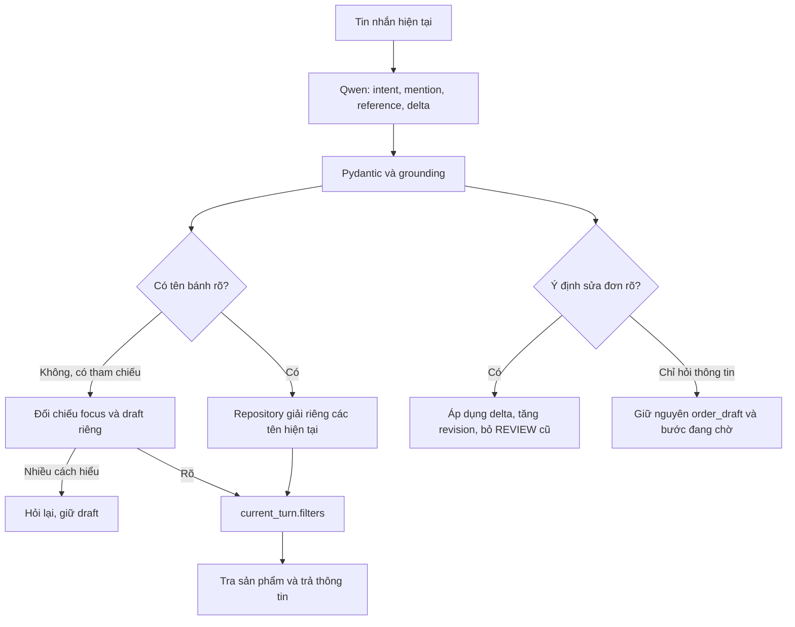

# Sửa phạm vi sản phẩm trong ngữ cảnh hội thoại

Cập nhật 04/10/2026. Đây là sửa lỗi sau stage 6; không bắt đầu stage 7.
Giữ Python 3.12.10, HTTP Ollama, model Qwen đang có, repository/FSM/tools,
SQLite và API/UI hiện tại. Không reset dữ liệu hoặc xóa lịch sử để chữa lỗi.

## 1. Nguyên nhân đã tái hiện thật

Đã đọc docs tiến độ/contracts/decisions/spec/integration/next_steps và code.
Trong SQLite test riêng, gọi **Qwen qwen3.5:4b thật** với hai câu:

1. “Tôi muốn đặt bánh socola”: draft chọn demo-001.
2. “Bánh dâu giá bao nhiêu?”: model trả kết quả sau:

```json
{
  "intents": ["price"],
  "action": "none",
  "product_mentions": ["Bánh dâu"],
  "reference": "last",
  "order_update": false
}
```

`product_mentions` đúng tên bánh dâu, nhưng `reference=last` thừa. JSON hợp
lệ chưa có nghĩa các trường nhất quán về ngữ nghĩa. Code cũ tin cả hai trường:

- **app/order_nlu.py — resolve_mentions():** giải tên dâu thành demo-002,
  rồi vẫn thực hiện nhánh reference. Với last, ưu tiên selected_id lấy từ
  bản nháp socola, thêm demo-001 vào cùng danh sách IDs.
- **app/conversation.py — handle_message():** truyền cả shown_products và
  product_id trong draft vào resolver mà chưa xác định phạm vi câu hỏi.
- **merge_preferences() và product_answer():** lưu IDs đã bị cộng vào
  needs.filters, rồi truy vấn bằng bộ lọc này; kết quả có cả socola và dâu.

Đây là lỗi ở cách ghép kết quả hiểu câu với trạng thái, không phải nguồn
giá sai. Draft trước sửa vẫn là socola trong lần tái hiện, nhưng câu trả lời
đã bị mở rộng sai đối tượng. Bằng chứng tại
[context_scope_before.json](../../evaluation/context_scope_before.json).

## 2. Ba phạm vi khác nhau

**Scope** là phạm vi dữ liệu áp dụng cho một thao tác. **Intent** là mục đích
câu nói; **mention** là cụm tên khách nhắc, chưa xác minh là sản phẩm có bán.
**Context** là thông tin hội thoại giúp giải câu nối tiếp. **Draft** là bản
nháp yêu cầu, chưa là đơn đã xác nhận.

| Phạm vi | Nơi lưu | Trách nhiệm |
| --- | --- | --- |
| current_turn | Dict riêng của một lần handle_message, có TypedDict CurrentTurn | Intent, mention, reference hiệu lực, ID đã đối chiếu và filters của truy vấn hiện tại |
| conversation_context | conversation["conversation_context"] lưu JSON SQLite | focus_product_ids/terms cho đối tượng vừa nói; shown_products giữ thẻ kết quả phục vụ first/second/cheaper |
| order_draft | Giữ tên cũ conversation["order"] | Sản phẩm đang đặt, size/topping/quantity/chữ/ngày nhận/contact/revision/REVIEW |

Không đổi key `order` thành tên mới để tránh phá API/schema/storage. Trong
prompt, nhóm tương ứng được đặt tên **order_draft** rõ ràng. Danh sách query
không dùng làm danh sách đặt hàng. Các list/dict được sao chép khi chuyển
phạm vi; sửa current_turn không sửa focus hoặc draft.

`needs` tiếp tục giữ sở thích/ràng buộc tư vấn (vị, ngân sách, servings...);
không giữ product_ids/query làm đối tượng của mọi câu hỏi. Dị ứng nêu rõ vẫn
được giữ làm ràng buộc an toàn, không bỏ để đề xuất thêm bánh.



## 3. Quy tắc đã triển khai

1. Có mention rõ thì dùng các tên này; không cộng thêm last/order dù model
   đồng thời trả reference khác none. Bánh không tìm thấy không quay sang
   báo giá bánh trong draft.
2. Chỉ giải tham chiếu khi không có tên rõ. “Giá bao nhiêu?” với intent
   thông tin và không có đối tượng được coi là tham chiếu ngầm, không truy
   vấn toàn menu. Đây là giải scope từ output Qwen, không regex phân loại
   câu hỏi thay Qwen.
3. Last có đúng một ứng viên hợp lệ từ focus/draft thì dùng; nếu khác nhau
   hoặc không có ứng viên thì hỏi lại. First/second dùng thẻ đã hiển thị;
   cheaper vẫn đối chiếu giá nguồn. Reference mới `order` chỉ dùng khi
   khách nói rõ bánh trong đơn/đang đặt.
4. Câu chỉ hỏi price/storage/size/... không cập nhật draft, kể cả model
   bật nhầm order_update=true. Ý định order_request, start_order, consent
   kèm thay đổi hoặc cập nhật slot rõ vẫn đi FSM cũ.
5. Query tên bánh cụ thể dùng filters mới. Size/ngân sách nêu trong câu
   chỉ ảnh hưởng query này; size16 trong draft socola không lọc câu hỏi dâu.
6. Hỏi rõ nhiều bánh trả đủ bánh đã xác minh, không cắt còn 5 thẻ. Browse
   chung vẫn giới hạn 5; schema LLM vẫn tối đa 10 mentions như trước. Nếu
   một trong các tên không có dữ liệu, nêu tên thiếu thay vì âm thầm bỏ qua.
7. Đổi sản phẩm đặt thì bỏ size/topping phụ thuộc, bỏ cake_need cũ, giữ các
   mong muốn độc lập như quantity/chữ/contact. Tăng revision, bỏ REVIEW và
   trạng thái xác minh cũ; các giá trị cần kiểm lại là unverified. Sau khi
   thu thập đủ, metadata/quote/stock/lead/chữ được kiểm lại bằng tools cũ.
8. Không xóa history. Context riêng từng conversation được persist cùng
   draft. Phiên cũ thiếu conversation_context được khởi tạo từ thẻ đã lưu,
   không migrate/xóa bảng và không lấy đối tượng từ phiên khác.

Nếu draft socola và chủ đề vừa hỏi dâu đều có thể là “bánh đó”, bot hỏi lại.
Khách có thể nói “bánh dâu” hoặc “bánh trong đơn của tôi” để làm rõ.

## 4. File và hàm thay đổi

| File | Thay đổi |
| --- | --- |
| [conversation.py](../../app/conversation.py) | is_information_question; build_current_turn; merge_preferences tách preferences; product_answer dùng query của lượt; advance_order chặn câu hỏi sửa draft; context riêng và kết quả current_turn nội bộ |
| [order_nlu.py](../../app/order_nlu.py) | resolve_mentions ưu tiên tên rõ, focus_ids riêng, last mơ hồ hỏi lại/order rõ, báo unresolved_mentions; apply_turn_updates bỏ trường phụ thuộc và REVIEW khi đổi bánh |
| [schemas.py](../../app/schemas.py) | CurrentTurn/ConversationContext TypedDict, mô tả mention/order_update, enum reference thêm order |
| [llm_client.py](../../app/llm_client.py) | Context prompt chia conversation_context/order_draft; tên từ repository; không gộp tên cũ vào mention; phân biệt giờ cửa hàng với stock bánh |
| [test_context_product_scope.py](../../tests/test_context_product_scope.py) | A–F và trường hợp mơ hồ, unknown/empty, flag sai, nhiều tên, riêng scope, safety constraint |
| [test_conversation.py](../../tests/test_conversation.py) | Kiểm tra không gửi contact/ID trong nhóm order_draft mới |
| [check_context_scope.py](../../scripts/check_context_scope.py) | Smoke Qwen thật, SQLite riêng, bốn lượt và report có previous_runs |

Không đổi repository contract, database schema, các route/token/API response
public, đường dẫn menu/policy, model, endpoint, timeout hoặc cách HTTP gọi
Ollama. Rule mode vẫn chỉ khi chọn chủ động; không trở thành fallback AI.

## 5. Đọc code then chốt

Trong resolver, nhánh tham chiếu hiện có điều kiện:

```python
if not mentions and reference != "none":
    # Chỉ lúc không có tên hiện tại mới đọc context/draft.
```

Đây là **quy tắc chọn phạm vi**, không là mô hình hiểu ngôn ngữ. Qwen vẫn
nhận diện câu hỏi/mention/intent trước. Repository vẫn xác định ID, giá và
khả năng có bán. Model sau sửa prompt đôi lúc vẫn trả last cùng tên rõ;
guard này tiếp tục bảo vệ, không chỉ trông chờ prompt luôn được tuân thủ.

`build_current_turn()` tạo filters mới cho câu hỏi có tên/tham chiếu; với
tư vấn chung mới lấy bản sao preferences. `product_answer()` nhận explicit
current_turn, không tự đọc danh sách sản phẩm đặt để mở rộng query.

`is_information_question()` kiểm intent/action do Qwen cung cấp. Khi câu
chỉ hỏi thông tin, advance_order không gọi apply_turn_updates. Draft bao
gồm revision/verification/REVIEW/pending date vẫn bằng bản trước, nhưng
history/focus hội thoại được cập nhật để tiếp tục nói chuyện.

**Deepcopy** tạo bản sao cả các list/dict bên trong; `list(ids)` tạo list
riêng chứa các ID string bất biến. **TypedDict** mô tả shape để học/công cụ
kiểm kiểu, không validate runtime. **Pydantic strict** validate output LLM
runtime, nhưng vẫn cần logic kiểm nghĩa và điều kiện nghiệp vụ.

Trong Python, dictionary dùng cùng list tham chiếu có thể gây lỗi sửa ở
một chỗ đổi chỗ khác. Không dùng default list dùng chung giữa khách; không
để current_turn, focus và order cùng trỏ một list.

## 6. Ví dụ trước và sau

| Câu sau khi đặt socola | Trước | Sau |
| --- | --- | --- |
| Bánh dâu giá bao nhiêu? | Socola250/350k và dâu280/380k | Chỉ dâu280/380k; draft socola giữ nguyên |
| Bánh đó giá bao nhiêu? (chưa hỏi bánh khác) | Có thể dùng draft | Socola nếu một ứng viên rõ; không sửa draft |
| Đổi sang bánh dâu | Có thể bị cộng hai ID nếu last thừa | Draft dâu, size/topping chọn lại, REVIEW cũ mất hiệu lực |
| Giá bánh dâu và socola? | Có thể đúng do vô tình cộng tên | Hai tên được hỏi, đủ giá từng bánh, không đổi đơn |
| Bảo quản bánh dâu thế nào? | Có thể lẫn socola | Dữ liệu dâu từ repository, bước thu thập socola giữ nguyên |

Mọi giá/size/storage là **mô phỏng**, không là menu chính thức. Empty không
bịa giá, giữ cake_need unverified và luồng lưu waiting_consultation. Mock
dùng fixture giá mẫu/nhãn demo. Nguồn thật vẫn cần adapter đủ quyền; sửa
scope không cấp thêm quyền tạo đơn.

## 7. Kiểm thử và cách chạy

Từ PowerShell ở root dự án:

Bổ sung 05/10/2026: nếu lệnh trước đây báo WinError5 trong `_pytest/tmpdir.py`
tại AppData/Temp, đã sửa conftest để dùng `.pytest_tmp/run-...` riêng trong
project. Chạy lại cùng lệnh; xem [bài sửa quyền thư mục tạm](pytest_temp_permissions.md).

```powershell
.\.venv\Scripts\python.exe -X utf8 -m pytest -q tests/test_context_product_scope.py
.\.venv\Scripts\python.exe -X utf8 -m pytest -q
# Gọi đúng Qwen đã cài; không tải model, DB smoke riêng
.\.venv\Scripts\python.exe -X utf8 -m scripts.check_context_scope
```

Test logic fake model + SQLite riêng, không gọi Ollama. Cố tình fake output
reference=last cùng mention để bảo vệ đúng lỗi thật, không làm fake model
“luôn hiểu đúng” rồi kết luận fix đạt. A kiểm cả mock và local_demo; empty,
unknown, six named products và dị ứng có regression riêng. B/C/F/mơ hồ và
đổi REVIEW có assertion so sánh draft/revision/history/persistence.

Kết quả cuối: **356 passed, 1 warning, 29.78s**, exit0; có 21 regression
mới trong test_context_product_scope.py. Warning Starlette/HTTPX có sẵn,
không là test thất bại. Chi tiết xem [progress](../progress.md).
Đã chạy Qwen thật trước sửa
và sau sửa; [before](../../evaluation/context_scope_before.json) có hai bánh
sai phạm vi, [after](../../evaluation/context_scope_after.json) có bốn lượt,
**4/4 đạt**, so sánh **toàn bộ draft**, không chỉ product_id. Không lấy test fake làm
độ chính xác model.

Đã kiểm thêm luồng Qwen đặt DEMO: REVIEW500k → sửa20cm REVIEW700k → một đơn
→ xác nhận lặp vẫn một. Lượt policy cuối từng bị model phân loại nhầm
availability; smoke rộng đó có passed=false và được giữ ở report. Làm rõ
prompt policy/availability rồi kiểm lại trên đúng phiên đã confirmed:
[policy followup](../../evaluation/context_scope_policy_followup.json) có
nguồn demo-policy-001/010, state DEMO_CONFIRMED, vẫn một đơn. Không gọi lượt
smoke rộng thất bại là “6/6 đạt”. Nguồn ngoài giờ có thể thừa; chưa đánh giá
nghĩa tổng thể stage 7.

API đang chạy cần restart để import Python mới, rồi tạo phiên/token mới.
SQLite history/draft không bị xóa; token RAM không tồn tại qua restart.
CLI có thể /resume CONVERSATION_ID để nạp lại bản nháp local đã lưu.

Trong lần sửa này đã restart API local cổng8000 và giữ chạy: /health,
HTML và JS trả200; tạo phiên trả201/BROWSING, chat_mode=ollama. Không gửi
đơn thử vào DB đang dùng. compileall exit0, link local của8file tài liệu
hợp lệ. Chưa kiểm click/render trong browser thật; HTTP200 không thay
nghiệm thu giao diện bằng mắt.

```powershell
.\.venv\Scripts\python.exe -X utf8 run_web.py
```

Giữ một server ở cổng8000, tải lại trang. Không cần Hội thoại mới giữa hai
câu A; chính cùng một phiên là tình huống phải kiểm. Nếu API khác còn chạy
code cũ, dừng cửa sổ đó bằng Ctrl+C rồi chạy lại. Không reset DB.

## 8. Giới hạn và kiến thức vấn đáp

Qwen có thể sai intent/reference/đọc liên kết; schema/grounding không chứng
minh hiểu đúng mọi câu. Câu ghép vừa hỏi bánh A vừa yêu cầu đổi bánh B nhưng
không rõ liên kết vẫn cần hỏi lại, chưa schema per-mention action. Một loại
bánh mỗi draft; nhiều loại trong yêu cầu đặt vẫn hỏi chọn rõ, không tự bỏ
loại khác. Browser thao tác/render chưa kiểm bằng công cụ; không có đánh
giá rộng hay stage7 trong việc này.

**Python:** dict/list/deepcopy, function parameters, TypedDict, mutable vs
immutable. **Backend:** controller chung CLI/API, JSON persistence,
session/token, revision/hash, test fixtures. **AI/NLP:** intent/mention,
reference resolution, prompt, structured output và validation ngữ nghĩa.
**Nghiệp vụ:** hỏi thông tin khác đặt/sửa đơn, phụ thuộc variant/topping,
REVIEW khác confirmed, không xác nhận khi dữ liệu chưa đủ.

1. **Vì sao model trả tên đúng mà bot vẫn trả dư bánh?** Vì resolver cộng
   thêm target từ draft khi reference thừa; cần kiểm scope ở code.
2. **Context và draft khác gì?** Context giúp hiểu đối tượng nối tiếp;
   draft là yêu cầu đặt có revision/slot, chỉ sửa khi ý định rõ.
3. **Tại sao không xóa history?** Sẽ mất khả năng nói nối tiếp và che lỗi
   thiết kế; tách trách nhiệm giữ được lịch sử và query đúng.
4. **JSON đúng có bảo đảm đúng nghĩa không?** Không; mention và reference
   có thể mâu thuẫn nhưng vẫn đúng kiểu/schema.
5. **Tên rõ cùng last thì ưu tiên gì?** Các tên hiện tại, không union draft;
   unknown phải báo thiếu dữ liệu, không fallback sang bánh cũ.
6. **Last có hai ứng viên xử lý sao?** Hỏi lại; không báo giá cả hai như thể
   khách đã hỏi cả hai, không chọn tùy tiện draft.
7. **Khi đổi bánh cần xóa/kiểm lại gì?** Size/topping phụ thuộc, review và
   verification cũ; revision tăng, các mong muốn giữ lại cần kiểm metadata.
8. **Fake model test có ý nghĩa gì?** Kiểm logic dưới output kiểm soát,
   gồm output model sai; khác smoke Qwen thật và accuracy tập độc lập.
9. **Tại sao restart không là xóa history?** Module Python cần nạp lại;
   session token RAM mất nhưng SQLite conversation/draft vẫn lưu.

Bài tập: thêm regression “hỏi size bánh khác khi REVIEW”; kiểm giá hai
bánh mà một tên unknown; vẽ và kiểm tra object không dùng chung list giữa
hai conversation. Dùng DB test riêng, không reset database demo đang dùng.

Phần cải thiện tiếp ngày05/10/2026 thêm requests có đối tượng/size riêng,
order_product_mentions/order_operation, alias grounding và bộ74nhãn.
Xem [bài học intent/context](../learning/intent_context_improvement.md).
Bản sửa A–F ở tài liệu này là nền tảng đã có trước phép đo baseline mới;
không đánh đồng baseline mới với bản lỗi gốc của báo cáo scope_before.
