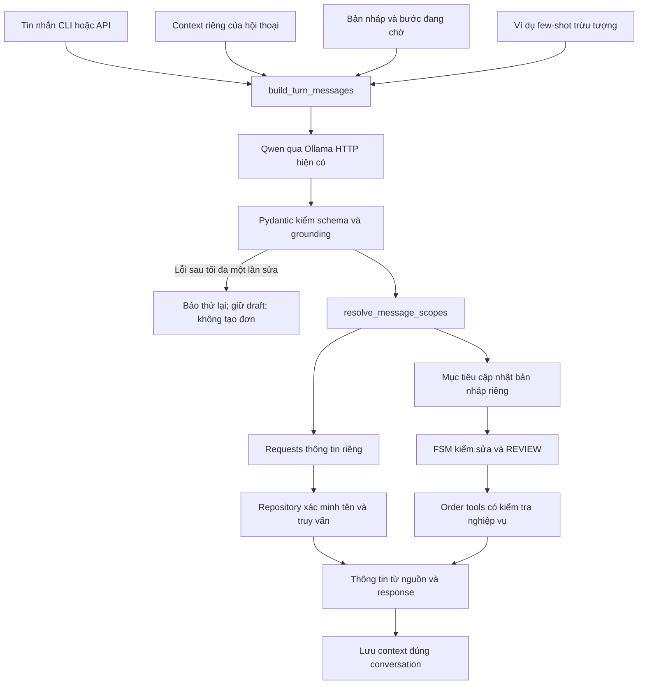

# Cải thiện intent và ngữ cảnh — 05–06/10/2026

Tài liệu này giải thích lần sửa sau giai đoạn 6. Qwen đang cài vẫn là `qwen3.5:4b`; Python 3.12.10, SQLite, CLI và API cũ được giữ. Không huấn luyện thêm model, không tạo chatbot thứ hai. Hai lượt đo dev và test cuối trên code bàn giao đã hoàn tất; kết quả thực tế và những lỗi còn lại ở mục 10.

## 1. Vấn đề thực tế trước khi sửa

**Intent** là ý định của người nói: hỏi giá, hỏi size, đặt bánh, sửa yêu cầu… **Slot** là thông tin có cấu trúc của yêu cầu, ví dụ số lượng, size, ngày nhận. Một tin nhắn có thể có nhiều intent và slot.

Lỗi lịch sử “đặt socola → hỏi giá dâu → trả hai bánh” có hai phần:

1. Qwen trả tên dâu cùng `reference=last`. Reference là chỉ dẫn tham chiếu đến đối tượng trước đó, ví dụ “bánh đó”.
2. `order_nlu.resolve_mentions()` trước lần sửa scope cộng ID socola trong bản nháp vào ID dâu. Bộ lọc lưu chung tiếp tục dùng cả hai ID để trả lời.

Đây là lỗi phối hợp giữa model và controller, không chỉ do model. Bằng chứng cũ còn ở [context_scope_before.json](../../evaluation/context_scope_before.json). Bản sửa scope trước công việc này đã ngăn trường hợp tên dâu rõ ràng bị cộng socola. Không gọi phép đo `before` mới là bản chưa từng sửa lỗi đó.

Lần này kiểm tra tiếp toàn đường đi và thấy các thiếu sót:

- Danh sách intent và tên bánh chung chưa thể diễn tả “giá dâu nhưng hương vị socola” hoặc hai bánh có hai size khác nhau.
- `check_catalog_grounding()` bỏ qua kiểm tra tên bị model bỏ sót khi có reference. Vì thế model có thể bỏ tên mới, trả `last` và khiến code tra bánh cũ.
- Kiểm tra tên quá sát nguyên văn có thể từ chối tên chuẩn trong database dù khách dùng một alias hợp lệ của cùng bánh. Alias là tên gọi khác, ví dụ “chocolate” cho socola.
- Chưa phân biệt rõ “thêm một bánh khác” với “đổi sang bánh khác”; bản nháp hiện chỉ hỗ trợ một loại bánh.
- Trace dev v7 cho thấy tên bánh cũ vẫn có thể bị copy từ context prompt dù đã chia nhóm. V8 gửi số lượng đối tượng/cờ đã chọn và bước thiếu, giữ tên/ID thật ở Python để giải reference; không xóa lịch sử.
- Trace `dev-006` phát hiện thêm: Qwen có request dâu đúng và request rỗng `last` trùng intent; resolver cũ còn tra bánh lịch sử. Đã thêm kế thừa chủ thể **trong lượt hiện tại**, dedupe scope và cue guard. Đây là lỗi code phối hợp output model, không chữa chỉ bằng đổi prompt.
- Qwen vẫn có thể hiểu nhầm câu trả lời cho slot thành câu hỏi thông tin, trích thiếu số lượng hoặc trả JSON sai. Phải đo riêng những lỗi này, không che bằng rule fallback.

## 2. Ba phạm vi phải tách

| Phạm vi | Dữ liệu | Ví dụ sau khi đặt socola rồi hỏi dâu | Lưu ở đâu? |
| --- | --- | --- | --- |
| `current_turn` | Các yêu cầu và bộ lọc của **tin nhắn hiện tại** | Chỉ hỏi giá dâu | Kết quả service; không persist vào hội thoại |
| `conversation_context` | Đối tượng đang được tham khảo, danh sách bánh đã hiển thị | Focus chuyển sang dâu | SQLite cùng context hội thoại |
| `order_draft` | Bản nháp đang thu thập, revision, REVIEW | Vẫn socola; bước đang chờ giữ nguyên | Key `order` cũ, SQLite |

**Persist** nghĩa là lưu dữ liệu để đọc lại sau khi chương trình dừng. Dữ liệu một lượt và dữ liệu bền không phải cùng vòng đời.

Không dùng một list làm cả ba nhiệm vụ. Các hàm tạo list/dict riêng, dùng `deepcopy()` khi cần. `deepcopy` sao chép cả cấu trúc lồng nhau, giúp sửa kết quả mà không vô tình sửa input.

“Bánh đó” chỉ được giải khi có ứng viên rõ. Nếu đang tham khảo dâu nhưng bản nháp là socola, `last` có thể mơ hồ; bot hỏi lại. “Bánh trong đơn” dùng `reference=order`. Tên rõ trong tin nhắn luôn ưu tiên hơn reference thừa. Tên mới không tìm thấy không được quay sang trả giá bánh cũ.

Sở thích như ngân sách, số người ăn và dị ứng nằm ở `needs`; không dùng `needs.product_ids` làm mục tiêu chung. Dị ứng đã biết được giữ để không đề xuất bánh trái ràng buộc khi khách chuyển chủ đề.

## 3. Luồng xử lý sau sửa



**HTTP** là cách gửi request và nhận response giữa các chương trình. Ollama chạy local; `llm_client.chat()` vẫn dùng endpoint, model, timeout và options hiện có. **Controller** là hàm phối hợp các bước; ở đây là `conversation.handle_message()`, không phải một framework agent.

Repository là lớp cung cấp dữ liệu qua interface, tức hợp đồng cách gọi và kết quả. Controller không cần biết dữ liệu từ SQLite, mock hay empty. **Grounding** ở đây là kiểm đề xuất có căn cứ trong câu hiện tại và tên từ repository; nó không chứng minh model đã hiểu hoàn toàn đúng nghĩa.

## 4. Schema mới: nhiều yêu cầu nhưng không trộn mục tiêu

**Schema** quy định cấu trúc và kiểu dữ liệu. Pydantic kiểm tra schema; JSON là định dạng trao đổi dữ liệu bằng object, list, chuỗi, số, boolean và null.

`LLMWireTurn` là output qua HTTP; `updates` là list `{field,value}` chỉ chứa trường được nhắc. `LLMTurn` là dạng nội bộ; `updates` chuyển thành `TurnUpdates` để code dễ đọc. `strict=True` không tự đổi chuỗi thành số; `extra="forbid"` từ chối field ngoài hợp đồng.

Ví dụ dạng nội bộ rút gọn, không phải payload HTTP đầy đủ:

```json
{
  "intents": ["price", "flavor"],
  "action": "none",
  "product_mentions": ["dâu", "socola"],
  "reference": "none",
  "requests": [
    {"intents": ["price"], "product_mentions": ["dâu"], "reference": "none", "size": "16 cm"},
    {"intents": ["flavor"], "product_mentions": ["socola"], "reference": "none", "size": null}
  ],
  "order_product_mentions": [],
  "order_operation": "none",
  "updates": {},
  "clear_slots": [],
  "order_update": false
}
```

`InformationRequest` chứa intent, tên, reference và size riêng cho **câu hỏi**. `order_product_mentions` chỉ chứa bánh khách chọn đặt/đổi/xóa. `order_operation` phân biệt:

| Giá trị | Nghĩa |
| --- | --- |
| `none` | Không sửa đơn |
| `select_product` | Chọn hoặc đổi sản phẩm |
| `add_product` | Yêu cầu thêm; không được hiểu thành thay thế |
| `remove_product` | Xóa sản phẩm được chỉ rõ |
| `update_slots` | Điền/sửa các trường của đơn |

Các intent trong request phải có ở list intent cấp ngoài. Một order operation phải đi cùng intent `order_request`. Model không được trả `product_id`, giá bán, tồn kho hay cờ đã xác nhận. Tên model trích chỉ là **mention**, tức cụm được đề cập, trước khi repository xác minh.

Slot không đề cập thì giữ nguyên. `updates` có giá trị thì cập nhật. Xóa phải dùng `clear_slots` hoặc operation rõ. `toppings=[]` nghĩa là khách chọn không topping; `None` nghĩa là chưa đề cập. Không được xóa size chỉ vì câu mới hỏi giá không có size.

## 5. File và hàm nên đọc

| File | Trách nhiệm của lần sửa |
| --- | --- |
| [schemas.py](../../app/schemas.py) | `InformationRequest`, schema output, operation và kiểm quan hệ intent |
| [llm_client.py](../../app/llm_client.py) | Prompt/context riêng, nạp few-shot, validate và sửa JSON tối đa một lần |
| [nlu_few_shots.json](../../data/nlu_few_shots.json) | 17 ví dụ bánh A/B/C trừu tượng; không là menu |
| [order_nlu.py](../../app/order_nlu.py) | Đối chiếu alias, kiểm thiếu/đổi tên, giải reference, áp dụng delta đã hợp lệ |
| [conversation.py](../../app/conversation.py) | Tách scope, truy vấn từng request, bảo vệ bản nháp và FSM |
| [intent_context_dev.json](../../evaluation/intent_context_dev.json) | 48 lượt có nhãn dùng điều chỉnh |
| [intent_context_test.json](../../evaluation/intent_context_test.json) | 26 lượt kiểm tra cuối; không đưa nhãn vào prompt |
| [prepare_intent_dataset.py](../../scripts/prepare_intent_dataset.py) | Nguồn tạo lại bộ nhãn viết tay, không gọi model |
| [evaluate_intent_context.py](../../scripts/evaluate_intent_context.py) | Đo Qwen thật và hành vi controller, database riêng |
| [compare_intent_context.py](../../scripts/compare_intent_context.py) | So sánh đúng cùng mẫu/hash; không bỏ lượt lỗi |
| [test_intent_context_improvement.py](../../tests/test_intent_context_improvement.py) | Test logic bằng model giả và các hội thoại có nhãn |

Những module order tools, storage, API và frontend tiếp tục dùng trách nhiệm hiện có; không tạo các module trùng.

| Hàm | Input → output | Nơi gọi |
| --- | --- | --- |
| `build_turn_messages(message, conversation, repository)` | Câu hiện tại/context → list system/user/assistant messages | `extract_turn()` |
| `schema_for_prompt(node)` | Schema Pydantic → bản gọn bỏ annotation nhưng giữ cấu trúc/ràng buộc/tên field | Builder prompt; không thay format HTTP |
| `extract_turn(message, conversation, base_url, model, timeout, repository)` | Tin nhắn/cấu hình → `{data: LLMTurn hoặc None, error, attempts}` | `handle_message()` |
| `catalog_alias_hints(message, repository)` | Câu hiện tại/nguồn → các alias có mặt, không ID | Builder prompt |
| `check_turn_grounding(message, proposal, repository)` | Đề xuất đã validate → mã lỗi hoặc `None` | Extractor, trước cập nhật |
| `check_catalog_grounding(message, proposal, repository)` | Câu/tên đã trích → lỗi bỏ tên hoặc `None` | Extractor |
| `resolve_mentions(mentions, repository, shown, reference, selected_id, focus_ids)` | Mention/tham chiếu → status, IDs, ambiguity, error | Resolver scope |
| `has_reference_cue(message)` | Câu đã che lettering → có dấu hiệu tham chiếu hay không; không trích intent | Resolver, để kiểm điều kiện dùng lịch sử |
| `resolve_message_scopes(current, proposal, repository, message)` | Context/đề xuất → current_turn, query tasks, order proposal, order resolution | Controller |
| `product_answer(repository, current, proposal, response, current_turn)` | Scope tra cứu → bổ sung text/cards từ nguồn | Mỗi query task |
| `describe_requested_products(products, intents)` | Sản phẩm/intent của request → văn bản đúng trường hỏi | `product_answer()` |
| `advance_order(current, proposal, resolution, message, tools)` | Đề xuất sửa đã tách → cập nhật order trong context và văn bản | Controller |
| `score_turn(item, result, proposal, previous_draft, order_count)` | Gold và kết quả **sau inference** → điểm từng tiêu chí | Evaluator/test logic |
| `summarize(steps)` | Tất cả lượt kể cả lỗi → số đạt/tổng/F1/lỗi | Evaluator/comparison |

`None` trong hàm kiểm lỗi nghĩa là chưa phát hiện lỗi, không có nghĩa mọi thông tin là chắc chắn đúng.

## 6. Code then chốt và lý do

Trong `resolve_message_scopes()`, mỗi request có `query = proposal.model_copy(deep=True)`. Code thay intent/names/size đúng request, bỏ các action, order operation và clear slots của đơn khỏi query. Nếu câu vừa sửa đơn vừa hỏi thông tin, slot đơn không được làm filter của câu hỏi. Kết quả query và `order_resolution` là hai biến riêng.

`reference = "none" if request.product_mentions else request.reference` ngăn reference thừa kéo bánh cũ vào tên đang hỏi. Repository vẫn xác minh mọi ID. Khi có nhiều cách hiểu, controller hỏi lại trước khi viết draft.

Nếu Qwen thêm request rỗng `last` khi câu chỉ hỏi “giá và size dâu”, resolver dùng chủ thể dâu duy nhất **trong tin nhắn hiện tại**, không lấy sản phẩm cũ. Hai scope giống nhau được bỏ trùng, tránh trả lặp. Nếu có nhiều chủ thể mà request rỗng chưa liên kết, bot hỏi lại. Có cue rõ “bánh trong đơn” vẫn cho phép truy vấn draft cùng bánh khác; “bánh đó” chưa xác minh như tên thật được hỏi lại. Regex ở `has_reference_cue` là guard hẹp cho việc dùng lịch sử, không là bộ hiểu intent chính và không chọn sản phẩm bằng từ khóa. Nó có thể không bao phủ mọi cách nói; phải kiểm thêm khi mở rộng.

`describe_requested_products()` chỉ hiển thị giá khi request có `price`, vị khi có `flavor`… Như vậy hỏi giá dâu và vị socola không bị trả giá socola như một phần câu hỏi giá. Các thẻ vẫn dùng dữ liệu sản phẩm thật từ adapter, có nhãn mô phỏng.

Guard catalog giờ không bỏ qua kiểm tên thiếu chỉ vì model trả `last`. Nếu khách nêu tên mới nhưng output bỏ tên đó, extractor yêu cầu model sửa một lần; vẫn sai thì báo thử lại. Không âm thầm dùng keyword để chọn tên thay model.

Tên chuẩn khác câu gốc chỉ được chấp nhận khi một alias xuất hiện trong câu **xác định duy nhất cùng sản phẩm**. Alias trùng giữa hai sản phẩm không được dùng để tự chọn một tên chuẩn. Tiền tố bánh/kem có thể lược khi nối tên: “giá bánh dâu và socola” cho phép mention “bánh socola” vì phần socola có trong câu; resolver vẫn xác minh ID. `catalog_alias_hints()` giúp Qwen thấy từ vựng từ nguồn, nhưng không cung cấp ID, giá hoặc stock và không quyết định intent/phủ định.

Nội dung trong ngoặc sau “ghi/viết chữ” được coi là dữ liệu lettering khi kiểm tên/lệnh xóa; “ghi chữ 'bỏ bánh dâu'” không được trở thành lệnh xóa. Đây là guard hẹp, không phải một bộ chống mọi dạng prompt injection hay mọi số xuất hiện trong lettering.

Khi query thứ hai lỗi nguồn, controller trả lỗi nguồn, giữ bản nháp; không trả một phần như thành công rồi tạo đơn. Khi Qwen lỗi, không dùng kết quả lỗi để sửa draft hoặc submit. Lịch sử không bị xóa để chữa lỗi context.

## 7. Few-shot, prompt, RAG và fine-tuning khác nhau

**Prompt** là chỉ dẫn và dữ liệu gửi model trong một lần gọi. **Few-shot** là vài ví dụ input/output đưa vào prompt để minh họa cách làm. File few-shot hiện có17 ví dụ trừu tượng: hỏi bánh khác, tham chiếu, phủ định, hai size, điền slot, xác nhận kèm sửa, thêm/xóa… Prompt v8 chọn tối đa3ví dụ hợp trạng thái FSM theo `priority`, giữ thứ tự file, không dò keyword để thay bộ hiểu chính. Đây là giới hạn lượng context, không bảo đảm mọi ví dụ trong thư viện được gửi ở mỗi trạng thái. Output mẫu không chứa menu, product IDs hoặc giá bán thật.

Prompt v8 dùng chỉ dẫn English kèm từ/câu Việt và schema rút gọn để model đọc cấu trúc. Format HTTP vẫn truyền schema đầy đủ; Python vẫn validate nghiêm ngặt. [Hướng dẫn structured outputs chính thức của Ollama](https://github.com/ollama/ollama/blob/main/docs/capabilities/structured-outputs.mdx) khuyến nghị đưa schema vào prompt. Đây là một lựa chọn đã thử trên dev, không chứng minh English luôn tốt hơn tiếng Việt hoặc schema trong prompt chữa mọi lỗi.

Context gửi extractor giờ chỉ có số đối tượng đã tham khảo/hiển thị, cờ focus trùng draft, có chọn bánh hay chưa, các trường đã điền/thiếu và trường đang chờ. Không gửi tên bánh cũ, giá trị preferences hoặc botquestions để model copy sang entity hiện tại. Model chỉ chọn `reference`; Python giữ các ID/cards thật để giải. Như vậy giảm dữ liệu gây lẫn mà không mất draft/lịch sử đã lưu. Preference values vẫn ở `needs` và được code kết hợp cho tư vấn tiếp, không bị xóa.

| Cách | Thay đổi gì? | Dùng ở đây |
| --- | --- | --- |
| Cải thiện prompt/few-shot | Chỉ dẫn, ví dụ, context của mỗi lần gọi | Có; giúp hiểu và gắn intent với đối tượng |
| RAG — Retrieval-Augmented Generation | Truy xuất tài liệu rồi cung cấp nguồn cho model trả lời | Đã có cho chính sách; không giải quyết thay cho mọi lỗi scope |
| Fine-tuning | Cập nhật trọng số model từ dữ liệu huấn luyện | Chưa làm; không thay trọng số Qwen |

RAG dùng **chunk**, tức một phần tài liệu; dự án chia theo điều khoản. Retriever tìm chunk phù hợp bằng từ khóa. Qwen chọn trích dẫn có source ID/version; Python kiểm nguồn. **Embedding** là biểu diễn văn bản bằng vector số để so độ gần nghĩa; chưa tải/chạy embedding trong lần sửa này.

Nhãn bộ kiểm tra cuối không có trong prompt. Builder chỉ đọc few-shot trong `data/`, không đọc file evaluation. Test có thể đọc nhãn để giả lập output và kiểm logic, nhưng đó không phải đo khả năng tự hiểu của Qwen.

## 8. FSM và an toàn nghiệp vụ được giữ

**FSM** (Finite State Machine) là máy trạng thái hữu hạn: trạng thái hiện tại quyết định hành động hợp lệ. Luồng local demo vẫn BROWSING → COLLECTING → REVIEW → DEMO_CONFIRMED; có CANCELLED/HANDOFF.

- Hỏi bánh khác giữ draft và bước thu thập đang chờ. Focus có thể đổi nhưng không là lệnh đổi bánh.
- Chọn/đổi sản phẩm rõ ràng làm size/topping phụ thuộc bánh cũ cần đối chiếu lại, tăng revision và bỏ REVIEW cũ. Revision là số phiên bản của bản nháp.
- “Đồng ý nhưng đổi size…” là thay đổi; phải REVIEW mới và đồng ý lại, không tạo ngay.
- Demo hiện một loại mỗi draft. “Thêm bánh dâu” khi đang có socola hỏi lại, không thay socola. Nếu có REVIEW cũ, yêu cầu thêm chưa giải xong làm REVIEW mất hiệu lực; giữ slot cũ để khách chọn tiếp.
- Xóa chỉ đúng sản phẩm trong draft; không dùng tên bánh khác để xóa nhầm. Đơn đã confirmed thì sửa/xóa đi hand-off local.
- Empty lưu **yêu cầu chờ tư vấn**, không confirmed và không báo giá thật. Mock/local_demo lấy giá từ adapter và ghi nhãn mô phỏng.
- Chưa đối chiếu vẫn `unverified`. Nguồn thật thiếu khả năng xác nhận bị từ chối; output model không mở quyền tạo đơn.
- Idempotency, kiểm/trừ tồn kho và transaction SQLite vẫn thuộc order tools hiện có. Idempotency là xử lý lặp một yêu cầu mà không tạo thêm đơn; transaction là nhóm thao tác cùng thành công hoặc cùng rollback.

## 9. Chạy trên Windows và ví dụ

Từ terminal PowerShell tại project, dùng trực tiếp Python trong .venv:

```powershell
Set-Location 'D:\Chatbot'
.\.venv\Scripts\python.exe -m pip install -r requirements.txt -r requirements-dev.txt
$env:CHAT_MODE = 'ollama'
$env:OLLAMA_MODEL = 'qwen3.5:4b'
$env:DATA_SOURCE = 'local_demo'
$env:ORDER_PROVIDER = 'local_demo'
$env:KNOWLEDGE_MODE = 'local_demo'
.\.venv\Scripts\python.exe -X utf8 -m scripts.database init
.\.venv\Scripts\python.exe -X utf8 -m scripts.database seed
.\.venv\Scripts\python.exe -X utf8 -m scripts.database check
ollama list
.\.venv\Scripts\python.exe -X utf8 main.py
```

Nếu Ollama chưa chạy, mở ứng dụng Ollama hoặc chạy `ollama serve` trong terminal riêng khi chưa có service. Không chạy `ollama pull` để vượt lỗi. `OLLAMA_MODEL` phải đúng tag đã cài; tag trên là tag đang có trên máy trong phiên đo. `.env.example` là mẫu, chương trình chưa tự đọc `.env`.

Web: dừng server cũ trong terminal của nó bằng Ctrl+C, chạy `.\.venv\Scripts\python.exe -X utf8 run_web.py`, rồi mở `http://127.0.0.1:8000/`. Restart làm token RAM cũ hết hiệu lực; bắt đầu một phiên mới rồi giữ **cùng phiên** khi thử hai câu. Không mở `static/index.html` bằng `file://`.

```text
Bạn: Tôi muốn đặt bánh socola.
Bot: Thu thập draft socola, hỏi size; chưa tạo đơn.
Bạn: Bánh dâu giá bao nhiêu?
Bot: Giá dâu mô phỏng theo size; draft socola giữ nguyên.
Bạn: Giá dâu size 16 và hương vị socola?
Bot: Giá dâu 16 cm; hương vị socola, không lấy size dâu sửa đơn socola.
Bạn: Đổi bánh trong đơn sang dâu.
Bot: Đổi mục tiêu đã đối chiếu, hỏi size/topping lại; REVIEW cũ không hợp lệ.
```

Đây là hành vi mong đợi, không cam kết model luôn trích đúng mọi cách diễn đạt. CLI `/draft` xem draft, `/orders` xem đơn thuộc hội thoại, `/new` bắt đầu mới, `/exit` thoát. Thử mock bằng `$env:DATA_SOURCE='mock'`; thử chưa nguồn bằng DATA_SOURCE=empty và KNOWLEDGE_MODE=empty trong terminal chạy mới.

## 10. Kiểm thử, đo thật và giới hạn

Đã chạy toàn bộ kiểm thử: **406 passed, 1 warning, 10.87 giây**, exit 0. Compileall app/scripts/tests/main/run_web exit 0, đã kiểm lại sau sửa controller cuối. Warning Starlette/HTTPX đã có, chưa thay dependency. Hai test mới ban đầu thất bại vì helper gán ngày nhận dạng local thô; đã sửa helper dùng `update_slot()` để chuẩn hóa UTC đúng contract. Guard recommendation ban đầu làm 4 test preferences cũ thất bại; đã tách quyền sửa draft với lưu nhu cầu tư vấn rồi toàn bộ kiểm thử đạt. Không hạ validation để làm test xanh. Bốn test cuối kiểm request rỗng/trùng, tham chiếu rõ đến đơn, nhiều chủ thể mơ hồ và tham chiếu bị model trả như tên bánh.

Test logic dùng database test riêng và model giả, chặn Ollama thật. 18 hội thoại chứa đủ 74 lượt có nhãn được chạy qua controller/FSM với output giả; cùng các test liên kết câu hỏi, đối chiếu nguồn, lỗi nguồn, cập nhật đơn, REVIEW và tách phiên. **406 không là số mẫu model tự hiểu đúng.**

```powershell
.\.venv\Scripts\python.exe -X utf8 -m pytest -q
.\.venv\Scripts\python.exe -X utf8 -m pytest -q tests/test_intent_context_improvement.py tests/test_context_product_scope.py
# Qwen thật; mỗi lần tự tạo DB nlu-eval riêng trong runtime
.\.venv\Scripts\python.exe -X utf8 -m scripts.evaluate_intent_context --split dev --label after
.\.venv\Scripts\python.exe -X utf8 -m scripts.evaluate_intent_context --split test --label final
.\.venv\Scripts\python.exe -X utf8 -m scripts.compare_intent_context
```

Tập dev: 48 lượt/11 hội thoại. Tập test cuối: 26 lượt/7 hội thoại. Nhãn do người triển khai viết tay, dữ liệu mô phỏng nhỏ, chưa có người gán nhãn độc lập. Không có tin nhắn/ID trùng giữa hai split; cùng các loại nhiệm vụ có thể xuất hiện ở cả hai. Chia theo hội thoại để không tách lượt của cùng phiên sang hai tập. **Split** là phần chia dữ liệu cho một mục đích đánh giá.

Evaluator chỉ gửi message, không gửi `label`/`expected` cho model. Báo cáo giữ raw output, proposal hợp lệ, truy vấn, draft trước/sau, điểm và lỗi. Lượt lỗi vẫn nằm trong mẫu số. `completed=true` chỉ nói đã đo hết, không có nghĩa tất cả lượt đạt. Khởi động lại phép đo lưu báo cáo cũ ở `previous_runs`.

**Qwen thật, cùng model `qwen3.5:4b`, đã chạy đủ 48 lượt dev và 26 lượt test cuối.** Hash các file code và few-shot trong hai báo cáo khớp code bàn giao. Baseline đã có bản sửa scope A–F trước công việc này; so sánh là hiệu quả kết hợp prompt, schema và controller, không chứng minh riêng few-shot tạo ra toàn bộ thay đổi.

| Tiêu chí | Dev trước (48 lượt) | Dev sau, code cuối (48 lượt) | Test cuối (26 lượt) |
| --- | --- | --- | --- |
| Đúng toàn bộ tập intent | 33/48 (68,75%) | 39/48 (81,25%) | 20/26 (76,92%) |
| Intent micro F1 | 0,7500 | 0,8842 | 0,8571 |
| Đúng tập sản phẩm tra cứu | 16/24 | 17/24 | 13/15 |
| Giữ nguyên toàn bộ draft khi có nhãn yêu cầu giữ | 29/29 | 29/29 | 17/17 |
| Qua schema và grounding | 46/48 | 41/48 | 21/26 |
| Đúng mọi tiêu chí extraction được chấm | 14/48 | 23/48 | 10/26 |
| Đúng mọi tiêu chí behavior được chấm | 30/48 | 32/48 | 21/26 |
| Lượt lỗi model/JSON/grounding | 2/48 | 7/48 | 5/26 |

**F1** kết hợp precision (tỷ lệ intent dự đoán đúng) và recall (tỷ lệ intent đúng được tìm ra). Micro F1 cộng số đúng/sai/thiếu trên mọi intent trước khi tính. Lượt model lỗi có dự đoán rỗng, vẫn tính thiếu vào điểm. Các hàng tra cứu/draft chỉ chấm những lượt có nhãn tương ứng; `behavior` không là đánh giá toàn văn câu trả lời.

Không cải thiện mọi tiêu chí: action dev giảm 43/48 → 40/48; state dev giảm 14/19 → 13/19; số lượt bị từ chối tăng 2 → 7. Guard chặt hơn giúp giữ draft nhưng cũng từ chối một số cách nói hợp lệ. Tất cả **7 lượt lỗi dev và 5 lượt lỗi test cuối giữ draft trước/sau hoàn toàn giống nhau**; không có lỗi nguồn controller trong hai phép đo.

Các lỗi thực tế còn lại:

- Test `test-012` “vani gia bn vay” và `test-014` câu phủ định không dấu: model bỏ tên cần tra, bị `missing_catalog_mention` từ chối.
- Test `test-017` đổi loại và `test-025` thêm bánh: model trả slot không có căn cứ, bị `ungrounded_slot` từ chối. Test `test-026` bỏ bánh: model thiếu mention. Nhận diện operation thêm/xóa **0/2** ở model thật, dù code logic tương ứng qua test giả; không gọi chức năng này đã ổn định với mọi câu tự nhiên.
- Dev còn lỗi tham chiếu, bỏ size, yêu cầu đầy đủ thiếu slot, hand-off và phủ định. Liên kết từng request chỉ đạt **1/3** ở cả dev và test cuối; trả đúng cards không chứng minh model đã gắn đúng mọi thuộc tính.
- Trong test cuối, các lượt đặt vani → hỏi giá socola → hỏi bánh trong đơn → bảo quản dâu và mock hỏi giá hai bánh đã trả đúng scope, giữ draft. `dev-006` với request rỗng dư và `dev-018` tham chiếu mơ hồ cũng được controller xử lý đúng sau sửa.

Bằng chứng: [so sánh dev](../../evaluation/intent_context_comparison_report.json), [trace dev sau](../../evaluation/intent_context_after_dev_report.json), [trace test cuối](../../evaluation/intent_context_final_test_report.json). Mỗi trace giữ input, output thô, scope, truy vấn, draft trước/sau và điểm; không loại câu sai khỏi mẫu số.

Sau hai phép đo, chạy lại smoke đúng lỗi gốc trên code bàn giao bằng `scripts.check_context_scope`: **4/4 đạt, exit 0**, toàn bộ engine `ollama`, không lỗi. Chuỗi đặt socola → giá dâu → bảo quản dâu → giá cả hai giữ toàn bộ draft socola; hai lượt dâu chỉ `demo-002`, lượt cả hai có đúng `demo-001` và `demo-002`. [Báo cáo smoke](../../evaluation/context_scope_after.json) giữ các lần trước và dùng database riêng, không sửa database demo đang dùng. Một smoke đạt không thay thế kết quả bộ 74 mẫu.

Các lần thử trước vẫn giữ trong báo cáo. V4 có 12 lượt lỗi/48 và behavior 26/48. V8 lần đầu dev đạt intent 40/48, query 20/24, behavior 34/48; test cuối lần đầu behavior 21/26. Guard controller cuối được bổ sung từ **dev-006/dev-018**, không đổi prompt/schema/dataset hoặc dùng lỗi test cuối chọn sửa. Đo lại cùng bộ để ghi kết quả đúng code cuối, giữ lần đầu trong `previous_runs`; kết quả dev lần sau thấp hơn lần đầu cũng được báo đúng. Đây là retest cùng tập, không là nhiều tập kiểm tra độc lập; chưa đo độ dao động có hệ thống. Xem [quy trình đo](../../evaluation/intent_context_protocol.md).

Nhãn `dev-044` được sửa từ REVIEW sang HANDOFF vì contract empty sau xác nhận lưu yêu cầu chờ tư vấn rồi ticket; message không đổi. Báo cáo trước gốc được giữ riêng, bản so sánh chấm lại đúng tiêu chí đó và ghi annotation revision. Không sửa prompt bằng nhãn kiểm tra cuối.

Phép đo này kiểm NLU và controller, **knowledge empty**, không đo độ đúng câu trả lời RAG. RAG có test riêng hiện có; stage 7 đánh giá tổng thể vẫn hoãn. UI click/render chưa kiểm bằng trình duyệt thật trong lần này. Vẫn một loại bánh mỗi draft, slot ngân sách dùng chung cho tư vấn và không bảo đảm mọi phép tính tương đối/viết tắt. Schema đúng không chứng minh nghĩa đúng; guard có thể từ chối câu có nghĩa hợp lệ. Khi bị từ chối, draft được giữ để thử lại.

## 11. Lỗi thường gặp

| Hiện tượng | Cách kiểm tra |
| --- | --- |
| Web vẫn hành vi cũ | Restart đúng server chạy project; tạo token mới; thử hai câu cùng hội thoại |
| Model/timeout/JSON lỗi | Kiểm `ollama list`, endpoint và diagnostics; giữ draft, thử lại; không tự đổi model |
| Chưa có menu | Kiểm DATA_SOURCE/DB init/seed; empty khác nguồn chạy mà không tìm thấy |
| Hỏi thêm bánh nhưng bot hỏi chọn lại | Draft chỉ một loại; xác định đổi loại hay tăng quantity rõ ràng |
| Reference mơ hồ | Nói tên bánh hoặc “bánh trong đơn”; không xóa history |
| Đánh giá chạy lâu | Model CPU/GPU và JSON repair tạo độ trễ; script đo serial, không là streaming |
| pytest WinError5 ở Temp cũ | Hook `.pytest_tmp/run-UUID` hiện có tránh basetemp AppData; xem bài sửa quyền Temp |

## 12. Kiến thức theo nhóm và câu hỏi vấn đáp

**Python:** dict/list, sao chép sâu, optional/default, type hint, pathlib, hàm có input/output. **Backend:** HTTP, Pydantic contract, repository, owner/session, SQLite và transaction. **AI/NLP:** intent/slot, tham chiếu, prompt/few-shot, lỗi structured output, đánh giá. **Nghiệp vụ:** đơn/bản nháp, REVIEW, giá chuẩn, tồn kho, unverified, empty/mock và quyền xác nhận.

1. **Vì sao lỗi đặt socola rồi hỏi dâu không chỉ do Qwen?** Gợi ý: Qwen có thể trả reference thừa; code cũ cộng ID và tái dùng filter chung. Controller phải bảo vệ scope.
2. **Intent khác slot thế nào?** Gợi ý: “hỏi giá” là mục đích; “dâu, size 16” là dữ liệu phục vụ mục đích.
3. **Ba phạm vi có cùng vòng đời không?** Gợi ý: current_turn ngắn; focus và draft persist nhưng có trách nhiệm khác.
4. **Vì sao mention chưa là product ID?** Gợi ý: model có thể sai tên; repository xác minh alias, ID và ambiguity.
5. **Pydantic chứng minh model hiểu đúng không?** Gợi ý: chỉ kiểm cấu trúc/kiểu/ràng buộc định nghĩa; vẫn cần grounding và đo nghĩa.
6. **Vì sao mỗi request có size riêng?** Gợi ý: giá A16 và B20 không được cùng filter size16; size query không sửa draft.
7. **Một tin nhắn vừa hỏi vừa sửa xử lý ra sao?** Gợi ý: requests tra thông tin; order mentions/updates sửa đơn; resolution riêng.
8. **Không đề cập topping khác chọn không topping ra sao?** Gợi ý: None không cập nhật, [] là lựa chọn rõ; clear_slots xóa rõ.
9. **Vì sao reference mơ hồ cần hỏi lại?** Gợi ý: focus dâu và draft socola là hai ứng viên khác nhau; đoán có thể sửa/tra sai.
10. **Few-shot có phải fine-tuning không?** Gợi ý: ví dụ trong lần gọi không đổi trọng số; fine-tuning cập nhật trọng số qua huấn luyện.
11. **RAG chữa lỗi trộn bản nháp không?** Gợi ý: cung cấp tài liệu; tách scope và FSM vẫn cần code/prompt đúng.
12. **Vì sao sửa draft làm REVIEW mất hiệu lực?** Gợi ý: khách đồng ý phiên bản cũ, giá/size/topping có thể đổi; revision và hash cần kiểm lại.
13. **Vì sao fake test đạt không nói Qwen đạt 100%?** Gợi ý: fake đã đưa output đúng; test kiểm controller chứ không kiểm inference thật.
14. **Vì sao không bỏ lượt model lỗi khi tính điểm?** Gợi ý: người dùng gặp lỗi thật; bỏ lỗi làm mẫu số nhỏ và tăng điểm không trung thực.
15. **Vì sao empty không xác nhận đơn?** Gợi ý: chưa có nguồn giá/tồn kho/khả năng nhận đơn; chỉ lưu chờ tư vấn, không bịa dữ liệu.

## 13. Năm bài tập nhỏ

1. Thêm một câu **dev** hỏi giá một bánh và topping bánh khác. Viết nhãn/expected trước, chạy fake test, giải thích hai query tasks.
2. Thêm test alias mới cho một sản phẩm, rồi tạo alias trùng hai sản phẩm. Chứng minh canonical expansion chỉ được phép khi duy nhất.
3. Trong bản sao dữ liệu demo, đổi giá một variant. Hỏi lại và chứng minh response lấy repository, không phải few-shot.
4. Thêm test “đồng ý nhưng bỏ topping” ở REVIEW. Kiểm revision tăng, REVIEW mới và chưa có order trước đồng ý tiếp.
5. Đọc một lượt Qwen thất bại trong report: xác định lỗi prompt/schema/grounding/resolution/FSM và đề xuất thay đổi **dev-only**. Muốn điều chỉnh tiếp phải tạo bộ kiểm tra cuối mới; không tối ưu theo nhãn final vừa chấm.

Trước bước tiếp theo, học thêm pytest fixture/monkeypatch, Pydantic validator, phân chia dữ liệu và precision/recall/F1. Đọc contracts trước khi thêm adapter/backend; regression phải giữ nguyên các bảo đảm draft/owner/transaction hiện có.
