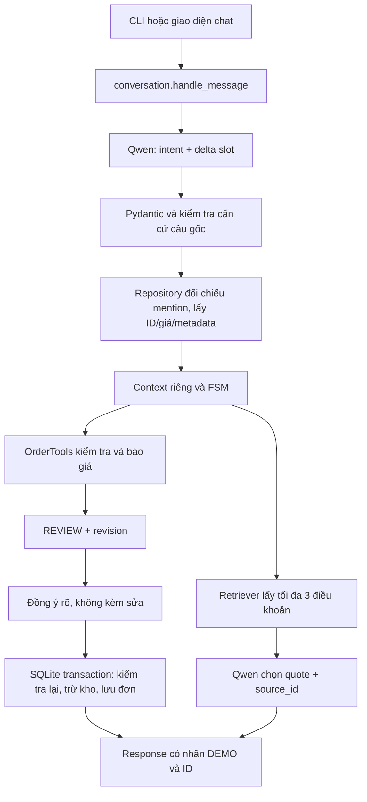

# Hoàn thiện chatbot local — bài học và vấn đáp

Cập nhật 04/10/2026. Python 3.12.10. Công việc nối tiếp stage 6, **không thực hiện giai đoạn 7**. Tất cả bánh, chính sách, đơn và liên hệ là mô phỏng.

## 1. Trước khi sửa và kết quả

Nền có terminal, Qwen HTTP, repository empty/mock, RAG từ khóa, FSM, SQLite v1 bốn bảng (schema là cấu trúc bảng/trường và kiểu dữ liệu đã thống nhất) và API/UI. Baseline 287 test đạt. Thiếu catalog/policy SQLite, seed đủ tình huống, trừ kho trong transaction, đơn có snapshot chuẩn hóa, lệnh quản lý CLI và context mới thống nhất. Lệnh đặt/xác nhận vẫn từng đi rule; Qwen lỗi từng tự fallback. Đã thay **luồng chính trong conversation.py**, không tạo chatbot thứ hai.

Hiện local_demo có 25 bánh, 35 biến thể, 3 topping, 13 điều khoản; repo/tool đọc ghi SQLite; mọi tin nhắn nghiệp vụ chế độ Ollama qua Qwen. Có ngân sách, tham chiếu kết quả, hỏi chính sách có nguồn, bản nháp nhiều lượt, REVIEW theo revision, đơn DEMO/unpaid, trừ kho nguyên tử, ticket pending, persistence và owner API. Một loại bánh mỗi draft, quantity nhiều; nhiều loại hỏi chọn rõ.

## 2. Kiến trúc và phân biệt kiến thức

**Python:** module là file .py; package là nhóm module, thường có __init__.py. import lấy hàm/kiểu từ module khác. Dictionary chứa trạng thái, deepcopy tạo bản sao tránh sửa phiên gốc khi lỗi. Type hint giúp người đọc/công cụ hiểu kiểu; Pydantic thực sự kiểm tra dữ liệu lúc chạy; validation là kiểm tra kiểu, trường và quy tắc có hợp lệ. Protocol mô tả phương thức cần có, không phải đối tượng tự gọi database.

**Backend:** repository là thành phần truy cập dữ liệu qua interface (hợp đồng cách gọi/kết quả), che nguồn JSON/SQL/API. API là giao diện gọi chức năng; HTTP là giao thức request/response; FastAPI xử lý request, SQLite lưu dữ liệu. Frontend HTML/CSS/JS gửi tin và hiển thị. Session token là bí mật ngẫu nhiên chứng minh quyền phiên; UUID chỉ định danh. Dependency injection nghĩa truyền repository/tool vào hàm thay vì hàm tự chọn nguồn.

**AI/NLP:** NLP xử lý ngôn ngữ tự nhiên; intent là mục đích, slot là thông tin cụ thể. Qwen là LLM đã được huấn luyện bởi nhà cung cấp; project không huấn luyện lại. Prompt là chỉ dẫn/ngữ cảnh gửi model. Structured output là JSON theo cấu trúc yêu cầu; vẫn cần validation vì đúng JSON chưa chắc đúng nghĩa.

**Nghiệp vụ:** sản phẩm, biến thể, giá/tồn kho, lead time (thời gian đặt trước), điều kiện nhận, REVIEW và consent (đồng ý rõ với bản xem lại) đều do dữ liệu và code kiểm tra. Qwen không có quyền tự tạo menu hoặc đơn.



Thứ tự không cho LLM bỏ qua kiểm tra. Repository không có kết quả khác nguồn chưa cấu hình; lỗi không chuyển thành thành công.

## 3. Bảng và quan hệ

SQL (Structured Query Language) là ngôn ngữ truy vấn bảng. Primary key định danh hàng; foreign key (khóa ngoại) buộc hàng liên quan tồn tại; CHECK kiểm tra giá trị.

| Bảng | Trách nhiệm và quan hệ |
| --- | --- |
| products | ID, active, tên, JSON mô tả/allergen/customization/lead/storage, nhãn demo |
| product_variants | FK products, size, giá nguyên VNĐ, servings, stock >=0 hoặc null |
| toppings / product_toppings | Topping/phụ phí/allergen và các cặp bánh–topping hợp lệ |
| policies | ID, title/content/version, source/is_demo; mỗi điều khoản là một chunk |
| business_settings | Giờ mở cửa, timezone, phương thức nhận, vùng/phí demo |
| conversations | Context đầy đủ dạng JSON và timestamp; mỗi khách một ID |
| messages | FK conversation, role, nội dung đã che liên hệ; lịch sử lưu riêng |
| drafts | Tương đương order_drafts; draft_id, conversation, revision, payload |
| submissions | Bản ghi yêu cầu/đơn cũ, unique idempotency key, owner/payload hash |
| orders | Phần mở rộng đơn chuẩn hóa, **cùng ID với submissions**, không là đơn thứ hai |
| order_items | Snapshot bất biến của bánh/biến thể/topping/giá/chữ, FK order |
| tickets | Tương đương handoff_tickets; pending, lý do/ưu tiên/owner/order liên quan |
| database_metadata | Dấu môi trường local_demo, phiên bản seed |

Giữ tên drafts/tickets/submissions để không phá dữ liệu/API cũ. orders FK cùng ID submissions; lưu hai phần của một bản ghi trong cùng transaction. Một đơn hiện một order_item. ID sản phẩm trong snapshot giữ nguyên kể cả nguồn đổi/xóa về sau, không buộc snapshot phụ thuộc catalog hiện tại.

SQLite v1 → v2: open_storage kiểm tra user_version, backup file v1 trước DDL (lệnh định nghĩa bảng), tạo bảng/kiểm tra FK và nâng phiên bản trong transaction. Demo submission cũ chuyển cùng ID sang orders, không trừ kho hồi tố. Nếu nguồn tên cũ thiếu thì snapshot legacy đánh dấu chưa có, không đoán tên. Không xóa hay dựng lại database.

Timestamp lưu ISO UTC; ngày nhận khách đưa được giải theo Asia/Ho_Chi_Minh rồi đổi UTC. API/JS/REVIEW hiển thị giờ Việt Nam. `data/` là thư mục file seed/schema, SQLite ở runtime là database.

## 4. File và hàm cần đọc

| File | Trách nhiệm |
| --- | --- |
| app/config.py, .env.example | Biến môi trường; default local_demo/Ollama, alias tên cũ |
| app/schemas.py | Product, kết quả nguồn/tool, LLMTurn/LLMWireTurn và Pydantic |
| data/local_demo_seed.json, schema_v2.sql | Dữ liệu mô phỏng và DDL v2 |
| scripts/database.py | init/migration, seed idempotent, check, reset có bảo vệ |
| app/repositories/catalog.py | Protocol/factory chọn nguồn một lần ở entrypoint |
| app/repositories/local_catalog.py | Adapter SQL catalog/metadata/policy/business settings |
| app/knowledge_loader.py, retrieval.py | Nguồn knowledge và retriever từ khóa giữ từ stage 4 |
| app/llm_client.py | HTTP Ollama loopback, chọn model đã cài, schema, retry có giới hạn |
| app/order_nlu.py | Đối chiếu mention/reference, grounding, ngày tương đối, áp dụng delta |
| app/conversation.py | Controller chung CLI/API, context, nối RAG và order tools |
| app/order_flow.py | FSM và revision, hỏi slot, REVIEW, xác nhận/handoff |
| app/order_service.py | Điều kiện nghiệp vụ, quote, submit transaction, owner tool |
| app/handoff.py | Ticket local pending, summary không liên hệ thô |
| app/storage.py | Một lớp sqlite3, migration/persistence/owner/hash/sanitization |
| main.py, run_web.py, app/api.py | CLI, launcher AI và route gọi chung controller |
| static/chat.js | TextContent, nhãn local_demo, thẻ/nguồn/REVIEW/UTC → giờ VN |
| tests/conftest.py, test_local_demo.py, các test cũ đã cập nhật | Fake model, DB riêng, lỗi/transaction/owner/context |
| scripts/check_local_demo.py, evaluation/local_demo_smoke_report.json | Smoke Qwen thật và kết quả kể cả các lần lỗi |

Không tạo adapter backend tương lai bằng file rỗng. Các module rule/fixture cũ giữ cho mode offline tường minh và bài học, không tự thay Qwen lúc lỗi.

| Hàm/phương thức | Input → output | Nơi gọi |
| --- | --- | --- |
| open_storage(path) | str/Path → connection SQLite, FK bật, schema v2 | CLI/API/repo/scripts |
| seed_database(connection, seed_path, manage_transaction=True) | seed giả → kết quả check; INSERT ID thiếu | scripts.database/main/test |
| search_products(filters) / get_product(id) | ràng buộc/ID → success/no_results/unconfigured/error + Product | controller/grounding/tools |
| get_order_metadata(id) / get_policy_documents() | ID hoặc không tham số → metadata/clauses có version | order_service/knowledge |
| new_conversation(conversation_id=None, max_turns=6) | cấu hình → dict context/bản nháp riêng | CLI/API/test |
| extract_turn(message, conversation, base_url, model, timeout=60, repository=None) | câu + context gọn → LLMTurn hoặc error/attempts | handle_message |
| resolve_mentions(mentions, repo, shown, reference, selected_id=None) | tên/tham chiếu → IDs đã xác minh hoặc ambiguous/error | controller |
| apply_turn_updates(message, draft, proposal, product_ids, now=None) | delta hợp lệ → bản sao draft, changed | advance_order |
| handle_message(message, repo, conversation, ...tools/storage) | một lượt → conversation/response/engine/lỗi | cùng CLI/API |
| create_review(draft, tools) / confirm_review(draft, tools, needs) | draft → draft mới + text | FSM/controller |
| inspect_order(repo, draft, now) | draft → availability/quote/verification/issues/fingerprint | check/quote/submit |
| create_order_tools(repo, connection, conversation_id, now=None) | dependencies → callable interface gắn owner | CLI/API |
| submit_local_order(connection, repo, draft, key, now=None) | REVIEW còn hiệu lực → ToolResult đơn hoặc lỗi, không tự commit | submit_order_request |
| get_order(connection, identifier, conversation_id) | ID + owner → available/unavailable | tool/API/CLI |
| retrieve(question, knowledge_repository) | câu hỏi → top chunks/version/hash/status | controller/RAG |
| extract_policy_answer(question, retrieval, base_url, model, timeout) | nguồn → supported/quotes đã validate hoặc lỗi | controller |

Xem chữ ký thật trong code khi trình bày; bảng lược tham số keyword để dễ đọc.

## 5. Code then chốt

### Delta: không nói đến, cập nhật, xóa

JSON HTTP gửi model dùng `updates: [{"field":"quantity","value":2}]`. Kiểu value phụ thuộc field: số nguyên/list/string/bool. Pydantic strict từ chối quantity="2" hoặc toppings="không topping"; không tự ép kiểu để che lỗi model. Chuyển wire list thành TurnUpdates dict nội bộ, từ chối field lặp.

- Không có field: giữ slot cũ; model sinh null không xóa slot.
- Field/value hợp lệ: cập nhật duy nhất thông tin này.
- clear_slots=["size"]: xóa rõ khi khách yêu cầu xóa, cần hỏi lại.
- Không topping: toppings=[] là đã chọn không topping; thiếu toppings khác []!
- Không viết chữ: cake_text="" là lựa chọn cụ thể, khác chưa biết.

`model_dump(exclude_none=True)` lấy thay đổi, `deepcopy` cho phép bỏ toàn bộ cập nhật nếu một slot sai. Model trả tên chỉ là mention; repo mới cấp product_id. Tham chiếu first/second/last/cheaper giải trên sản phẩm đã hiển thị/đối chiếu, mơ hồ hỏi lại.

Grounding là kiểm tra căn cứ literal/số/ngày trong câu gốc; nó chỉ chặn/sửa sai, không dùng rule để thay intent. Khi model bỏ tên đang có trong câu/repository, yêu cầu **model sửa** tối đa một lần, không tự chèn tên. Đây chưa là bằng chứng hiểu đúng mọi phủ định/ngữ nghĩa.

### Context gọn và lỗi AI

Context mỗi conversation có history giới hạn 6 lượt, needs riêng, draft, sản phẩm đã hiển thị, unknown_streak. Lưu SQLite và nạp lại CLI. Prompt chính gửi trạng thái field filled/missing, key nhu cầu, tên kết quả, giờ hiện tại và hai câu hỏi gần nhất; **không chép lại toàn bộ giá trị chữ/ngày/số lượng cũ**. Qwen thật từng chép REVIEW cũ vào delta; guard từ chối; context gọn giảm lỗi này. Giá trị đầy đủ vẫn do code lưu, không dùng chung khách.

Đánh đổi: context gửi model không là mọi tin nhắn/value trước, nên phép toán như “thêm một so với lúc nãy” chưa bảo đảm hiểu đúng; dùng “đổi số lượng thành ba”. Giới hạn lượt không thay thế đo token đầy đủ.

HTTP timeout tối đa 60 giây mỗi call, kiểm tra status/model/done. JSON/schema/grounding sai sửa tối đa một lần; timeout/HTTP/model thiếu không retry vô hạn. Lỗi không chuyển rule, không cập nhật draft/history từ kết quả lỗi, không tạo đơn. Rule chỉ khi người dùng chủ động CHAT_MODE=rule.

### FSM và xác nhận

FSM (finite state machine) là tập trạng thái và quy tắc chuyển. Slot filling là điền các trường cần thiết qua nhiều lượt.

BROWSING → COLLECTING → REVIEW → DEMO_CONFIRMED. Có CANCELLED/HANDOFF. REVIEW chưa là đơn. Mỗi sửa slot tăng revision và bỏ review cũ. Review giữ revision, hash slots và fingerprint nguồn/quote. “Đồng ý nhưng đổi size” chứa sửa, phải review mới dù model quên order_update. “Xác nhận” riêng sau REVIEW hợp lệ mới gọi submit. Đơn confirmed bất biến; sửa/hủy thành ticket, không đổi snapshot.

Product active, size/topping tương thích, integer quantity>0, tồn known đủ, lead time và giờ nhận, giới hạn chữ, pickup/delivery/liên hệ giả đều được kiểm tra lại. Nguồn không biết → unknown/unverified, không tự dựng chính sách. Dị ứng chuyển nhân viên local; không bỏ ràng buộc để gợi ý thêm.

Chữ Unicode chuẩn NFC giữ nội dung khách. Đếm `len` sau NFC là **Unicode code point**, không là byte hay ký tự hiển thị (grapheme). Emoji ghép có thể tính nhiều code point; không âm thầm cắt chữ. Giới hạn lấy metadata, không số hardcode FSM.

Quote = (giá biến thể + tổng phụ phí topping + phí chữ mỗi chiếc) × quantity + phí giao mỗi đơn. Tiền integer VNĐ tránh sai số float. Empty không báo giá thật; local_demo chỉ báo giá mô phỏng.

### SQL transaction và idempotency

Transaction là nhóm thay đổi cùng thành công hoặc cùng rollback. Idempotency là lặp một yêu cầu hợp lệ không tạo thêm tác dụng.

```sql
BEGIN IMMEDIATE;
-- Đọc lại product/metadata và kiểm tra revision/hash/nguồn trong cùng connection
UPDATE product_variants
SET stock_quantity = stock_quantity - ?
WHERE id = ? AND product_id = ? AND stock_quantity >= ?
  AND stock_status = 'in_stock';
-- rowcount phải là 1; lưu submission + orders + order_items + conversation
COMMIT;
```

SQLite tuần tự hóa writer bằng BEGIN IMMEDIATE; điều kiện UPDATE + CHECK stock>=0 chống oversell. SAVEPOINT cho tool rollback phần thay đổi nếu submit lỗi; transaction ngoài ở controller commit cả đơn và context/messages. Lỗi trigger khi insert phải rollback stock, không lưu nửa đơn. SQL dùng `?` tham số, không nối thông tin khách vào lệnh SQL. `with connection` chỉ commit/rollback, **không đóng connection**; dùng finally/close hoặc contextlib.closing để đóng file, đặc biệt trên Windows.

Key dựa draft_id/revision; UNIQUE chống tạo trùng. Cùng key phải cùng owner/revision/payload, khác payload là conflict. Snapshot lưu tên/size/topping/giá/chữ/quote lúc tạo; menu đổi sau không đổi đơn cũ. Seed ON CONFLICT DO NOTHING giữ tồn kho bị tiêu bởi demo. Reset riêng có xác minh path/environment/demo, --confirm, backup trước, rollback nếu seed lỗi.

### RAG và nguồn

RAG (retrieval-augmented generation) là truy xuất tài liệu trước khi model trả lời. Chunk là phần tài liệu: ở đây mỗi điều khoản một chunk, ID policy_id/version. Retriever từ khóa lấy tối đa 3; Qwen chọn quote nguyên văn/source_id. Code kiểm tra ID trong chunks và quote là substring content. Không có nguồn/không đủ → nói chưa đủ thông tin. Tài liệu là dữ liệu, không là lệnh.

Embedding là vector số biểu diễn văn bản, có thể dùng similarity để truy xuất; chưa tải/triển khai vì retriever từ khóa đủ chạy demo. ID/quote hợp lệ **không chứng minh đoạn được chọn trả đúng mọi ý câu hỏi**; smoke có thể kèm nguồn ngoài giờ thừa. Đánh giá semantic tổng thể thuộc stage 7, còn tạm hoãn.

### Session và handoff

API random token 256 bit, server giữ hash trong RAM gắn đúng conversation; order tool lọc cả owner. UUID không cấp quyền. def route chạy threadpool để Ollama/SQLite đồng bộ không chặn event loop; connection mở cùng thread, lock riêng phiên. Một worker, TTL 8 giờ; restart token hết hiệu lực dù data còn. CLI resume là công cụ local có quyền đọc file, không mang cơ chế đó lên web.

Ticket pending lưu reason/priority/summary/missing_information/order cùng owner nếu có. Nhờ nhân viên, hai fallback liên tiếp, dị ứng, khiếu nại, sửa confirmed, nghiệp vụ unknown đều có đường handoff. Ngoài giờ vẫn ghi ticket, thông báo theo policy mô phỏng; chưa gửi ra dịch vụ ngoài. Debug mặc định không in contact/token; history sanitizer cơ bản không bảo đảm loại mọi PII, vì vậy chỉ thử dữ liệu giả.

## 6. Chạy và ví dụ

Lệnh Windows đầy đủ tại [README](../../README.md): dependency, init/seed/check, tags, CLI, web, pytest, smoke và reset. Gọi Python trong .venv; .env.example chưa tự nạp. Đường dẫn qua pathlib không phụ thuộc D:\Chatbot hay dấu/space.

Tư vấn: “socola dưới 300k” → repo lọc 16 cm/250.000; “giá và size bánh socola” → 16/20 cm/250.000/350.000; “giờ mở cửa” → quote demo-policy-001/version. Chưa có nguồn thì empty không bịa.

Đặt: hai socola 16 cm + không topping + chữ Chúc vui + 2099-01-04 10:00 pickup + DEMO Khách A + TEST-0001 → REVIEW500.000. “Đồng ý nhưng đổi sang size20cm” → REVIEW700.000, 0 đơn. “Xác nhận” → 1 đơn DEMO/unpaid, stock20→18; xác nhận lại vẫn1. Đã chạy thật Qwen trên DB smoke riêng; đọc report cho text đầy đủ.

CLI `/draft`, `/orders`, `/order ID`, `/new`, `/exit`, `/resume CONVERSATION_ID`; chỉ xem đơn đúng phiên. Sau restart resume giữ slots/history/revision. API/UI gọi cùng handle_message, không viết lại logic trong route.

## 7. Kiểm thử và giới hạn

Test logic dùng model fake, database pytest riêng, có chặn urlopen; không gọi model thật hay reset DB demo. Bao phủ seed lặp, giá/size/ngân sách/multi-intent/reference, delta/clear, slot tự nhiên, metadata sai, unknown/hết kho, giờ/lead/chữ, thiếu slot, revision/consent kèm sửa, idempotency, trigger rollback, hai writer cạnh tranh, AI error giữ draft, owner/separate/restart, chính sách và allergy handoff, migration v1/backup/reset an toàn. Regression wire kiểm tra đúng kiểu và yêu cầu model sửa tên thiếu.

Kết quả cuối: **335 passed, 1 warning, 11.62s**; pip check/compileall/JS parse đạt. API HTTP thật chat Qwen đúng/401 thiếu token/404 khác phiên; CLI thật giá-size, /orders và /exit đạt. Chi tiết [progress](../progress.md). Smoke real sáu lượt đạt với qwen3.5:4b; không coi fake test là model accuracy. Các lần smoke trước lỗi timeout, thiếu tên, copy slot, bỏ liên hệ, sai intent, abstain policy đều giữ trong previous_runs, không che lỗi. Model thật vẫn có thể sai; kiểm tra chặn chứ không bảo đảm mọi câu tự do.

Browser công cụ không khả dụng: HTTP health/assets có chạy, API TestClient có test, **chưa click UI/render/responsive/XSS DOM thật**. Chưa đánh giá rộng NLU/RAG, nhiều khách/benchmark phần cứng, nhiều process cùng phiên, embedding/multi-item, real contact/login/backend/payment/delivery. Một warning Starlette dùng HTTPX deprecated, chưa đổi dependency chỉ để bỏ warning.

## 8. Lỗi thường gặp

- Failed to fetch: JavaScript chưa nhận được HTTP response, không đồng nghĩa model lỗi. Kiểm tra /health và server run_web.py; trang đã tải có thể còn mở sau khi server dừng. main.py không khởi động API. Tải lại Ctrl+F5/bấm Hội thoại mới sau khi server chạy. Không reset database.

- No module named app: chạy `python -m scripts.database` từ root, không chạy scripts/database.py trực tiếp.
- Model_not_found: tags và tên chính xác; không tự tải/đổi model.
- Timeout/invalid_turn_json/ungrounded_*: draft giữ nguyên, thử câu ngắn rõ hơn; xem diagnostics không nhập contact thật.
- Chưa có 25 bánh: chọn DATA_SOURCE=local_demo, đúng DATABASE_PATH và chạy seed; check kiểm tra counts.
- Sửa seed không đổi menu: seed cố ý không overwrite; chỉnh SQLite có kiểm soát, hoặc reset nếu chấp nhận mất demo history.
- database locked: tránh nhiều process sửa cùng phiên, dừng writer khác rồi thử lại; không xóa file DB để chữa lỗi.
- Size/topping sai: hỏi options của bánh; không gọi mong muốn là lựa chọn có bán.
- Unknown stock/giờ nhận/lead/chữ: xem issues, sửa dữ liệu hoặc chuyển ticket, không ép xác nhận.
- 401 sau reload/restart: tạo phiên mới, không dùng UUID làm token; CLI resume riêng local.
- PowerShell chặn Activate.ps1: gọi .venv\Scripts\python.exe trực tiếp. Path có space đặt nháy.
- Font tiếng Việt terminal: Python -X utf8; file UTF-8. Giữ chữ khách NFC, không normalize_text chữ viết bánh.

## 9. Mười lăm câu hỏi vấn đáp

1. **Tại sao Qwen không trực tiếp tạo đơn?** Gợi ý: output là đề xuất không đáng tin hoàn toàn; code/repo xác minh dữ liệu và quyền, FSM cần consent.
2. **Repository khác database thế nào?** Gợi ý: repository là interface truy cập; SQLite là một cách lưu. Thay adapter giữ caller.
3. **Dependency injection ở đây ở đâu?** Gợi ý: handle_message nhận repo/tools/knowledge; create_app/test truyền fake nguồn.
4. **Pydantic khác type hint?** Gợi ý: type hint mô tả; Pydantic validate runtime, strict không ép chuỗi thành quantity.
5. **Không đề cập và xóa slot khác gì?** Gợi ý: omitted/null giữ cũ, updates set, clear_slots chỉ explicit deletion; []/"" có ý nghĩa cụ thể.
6. **Model trả tên bánh vì sao chưa có product_id?** Gợi ý: mention chưa xác minh, repo giải alias/mơ hồ và ID ổn định.
7. **Làm sao không dùng chung context khách?** Gợi ý: dict riêng, deepcopy, UUID separate, SQLite owner, token/lock phiên.
8. **REVIEW có revision/hash để làm gì?** Gợi ý: sửa hoặc nguồn/quote đổi làm consent cũ hết hiệu lực, phải review lại.
9. **“Đồng ý nhưng đổi size” có tạo đơn không?** Gợi ý: có edit nên review mới; explicitchange guard không phụ thuộc order_update model luôn đúng.
10. **Transaction ngăn oversell thế nào?** Gợi ý: BEGIN IMMEDIATE cùng connection, UPDATE stock>=qty, CHECK, insert/stock rollback cùng nhau.
11. **Idempotency khác nhận diện hai đơn giống nhau?** Gợi ý: key request/revision chống retry, không cấm người cố ý đặt hai draft giống nội dung.
12. **Vì sao đơn lưu snapshot?** Gợi ý: catalog/giá đổi sau không thay hợp đồng demo đã xem/xác nhận; phục vụ tra cứu.
13. **RAG source_id hợp lệ đã đủ chứng minh đúng chưa?** Gợi ý: chưa; quote có trong nguồn vẫn có thể không trả đủ hoặc không liên quan câu hỏi; cần semantic eval riêng.
14. **Unknown allergen/stock và not_listed xử lý sao?** Gợi ý: không khẳng định an toàn/còn hàng; ticket và chưa confirmed, không thay unknown bằng 0.
15. **Kết nối backend cần thay gì để không tạo hai đơn?** Gợi ý: adapter repo/tools, ID mapping, provider độc quyền/nguồn authoritative, server transaction/idempotency/auth; không gửi demo lịch sử sang thật.

## 10. Năm bài tập nhỏ

1. Thêm bánh demo-026 vào seed và biến thể, chạy seed hai lần trên DB thử riêng; viết test count/giá, không sửa NLU/prompt.
2. Thêm câu hỏi chính sách mới vào test retrieval local, đo đoạn đúng/thừa; không sửa gold để che lỗi retriever.
3. Đổi giờ mở cửa trong business_settings DB thử; chứng minh REVIEW ngày/giờ sai bị chặn mà FSM không đổi.
4. Thêm test Unicode: chữ tổ hợp, emoji gia đình và limit; giải thích code point khác grapheme. Không cắt chữ tự động.
5. Vẽ mock backend contract đọc-only: thay repo bằng fake và xác minh submit unsupported. Không tạo API adapter giả success.

Trước bước tiếp: học SQL SELECT/JOIN/transaction, Pydantic/typing, HTTPstatus/token, pytestfixture/monkeypatch, datetime/ZoneInfo, precision/recall và bộ held-out. Chốt backend contract với nhóm trước nối; stage 7 cần yêu cầu riêng và tiêu chí đánh giá độc lập.
