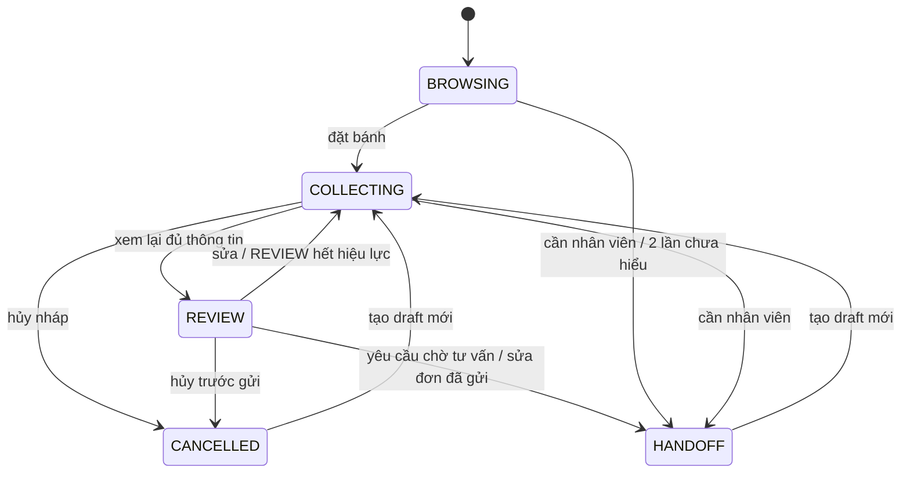

# Giai đoạn 5 — Thu thập nhu cầu và đặt bánh mô phỏng

Thực hiện ngày 03/10/2026, Python 3.12.10/.venv trên Windows. Đây là bài học
theo code đã chạy; stage_01–04 giữ làm lịch sử, không tự làm giai đoạn 6.

## 1. Mục tiêu và chức năng đã hoàn thành

**FSM** (Finite State Machine, máy trạng thái hữu hạn) là cách mô tả chương
trình có các trạng thái và chỉ chuyển theo điều kiện. Bot có BROWSING (đang
tham khảo), COLLECTING (thu thập), REVIEW (xem lại), CANCELLED (đã hủy nháp)
và HANDOFF (chuyển yêu cầu cần người xử lý). **Slot filling** là điền các
trường thông tin cần thiết, không có nghĩa cửa hàng có thể đáp ứng.

Đã thu nhu cầu/mã đề xuất, size/topping/quantity/chữ/ngày giờ nhận/hình thức
nhận và liên hệ giả. Có REVIEW có phiên bản, kiểm tra lại nguồn lúc gửi,
tính total demo, chống xác nhận trùng, lưu/nạp phiên và ticket bằng SQLite.
Empty vẫn thu được yêu cầu nhưng không có quote thật hoặc đơn đã xác nhận.
Mock đủ điều kiện mới có đơn DEMO. Những lựa chọn chưa đối chiếu là unverified.

**Bản nháp** là thông tin đang thu thập/chưa được chấp thuận. **Đơn xác nhận**
trong bản này chỉ là demo được code kiểm tra và khách xác nhận rõ. Yêu cầu
waiting_consultation là “chờ tư vấn”, không phải đơn xác nhận. **Handoff** là
lưu ticket (phiếu yêu cầu xử lý), chưa gửi nhân viên hoặc nói họ đã nhận.

SQLite này lưu dữ liệu chatbot; không tạo database sản phẩm. Không thêm
FastAPI/UI, thanh toán/giao thật, model hoặc adapter dữ liệu thật. Các lệnh
nghiệp vụ chạy bằng code, không gọi LLM dù chọn CHAT_MODE=ollama. Chat tư vấn/
RAG cũ vẫn hoạt động. Rule là code theo quy tắc, không gọi là model đã huấn luyện.

## 2. File tạo/sửa và trách nhiệm

| File | Trách nhiệm |
| --- | --- |
| app/order_flow.py — mới | FSM/slot, tạo/hiển thị REVIEW, xác nhận/hủy/handoff qua tool, trả bản sao. |
| app/order_service.py — mới | Adapter tool, đọc nguồn qua interface, validation nghiệp vụ, quote và gửi demo/yêu cầu. |
| app/handoff.py — mới | Nhận trigger, tóm tắt nhu cầu, lưu ticket pending; không gửi thông báo. |
| app/storage.py — mới | SQL/schema v1, transaction do caller quản lý, idempotency/hash, lưu/nạp phiên. |
| data/mock_order_metadata.json — mới | Giới hạn/phụ phí/số lượng giả lập có nhãn mock, tách khỏi logic/policy RAG. |
| app/repositories/mock_catalog.py | Thêm optional get_order_metadata, giữ ba method cũ và Product/Variant. |
| app/schemas.py | OrderTools/ToolResult, Conversation thêm order và unknown_streak. |
| app/config.py, .env.example | CHATBOT_DB_PATH mặc định runtime/chatbot.sqlite3. |
| app/conversation.py | Inject tool/connection, route lệnh trước LLM, history riêng, counter/handoff và transaction. |
| main.py | Khởi tạo SQLite, tool theo ID phiên; vòng terminal/lệnh nạp phiên, đóng connection trong finally. |
| requirements.txt | Thêm tzdata==2026.4; không cài AI nặng. requirements-dev kế thừa runtime, không đổi. |
| tests/test_order_flow.py — mới | FSM/nguồn/slot/source đổi/cancel/handoff/quote/CLI và hai mode. |
| tests/test_storage.py — mới | SQLite thật trong file tạm, nạp lại/phiên riêng/SQL/unique/rollback. |
| README.md, data/README.md | Lệnh hiện tại, dữ liệu mock mới, ví dụ test và giới hạn. |
| docs/project_spec.md, progress.md | Phạm vi và kết quả thực tế stage 5. |
| docs/decisions.md, contracts.md | D50–D60, chữ ký/schema/điều kiện tool và SQL. |
| docs/data_integration.md, next_steps.md | Nối metadata/adapter thật sau và điều kiện bước 6. |
| docs/learning/stage_05.md | Bài học này. |

runtime/chatbot.sqlite3 được **sinh khi chạy**, không thuộc mã nguồn. .gitignore
đã bỏ *.sqlite3/*.db; không cần sửa ignore hoặc ghi .venv vào Git. DB có bốn
bảng chatbot, không có bảng sản phẩm. Không xóa code giai đoạn trước.

## 3. Luồng đầu vào → xử lý → đầu ra

```text
đặt bánh → COLLECTING
  → nhập từng slot (giữ nhu cầu chưa xác minh)
  → xem lại → đủ trường/đúng kiểu/giờ local?
  → check_availability + calculate_quote qua interface
  → REVIEW {revision, hash slots, fingerprint nguồn, quote}
  → xác nhận → kiểm tra lại slot/hash/nguồn/khả dụng
       empty: lưu waiting_consultation, confirmed=false + ticket → HANDOFF
       mock đủ: lưu demo_order, confirmed=true (DEMO), trả ID
       thiếu metadata: lưu chờ tư vấn + ticket, không xác nhận demo
       nguồn lỗi/không đủ tồn/REVIEW cũ: không xác nhận
```

Tư vấn bình thường đi nhánh NLU/RAG cũ. Lệnh FSM được nhận diện trước gọi
model, nhờ vậy “tên: ...” không cần model hiểu để lưu slot. Handoff theo câu
yêu cầu người thật/dị ứng nghiêm trọng/khiếu nại/sửa đơn xác nhận; hai lượt
fallback liên tiếp cũng lưu ticket. **Fallback** là nhánh thay thế khi chưa
hiểu hoặc model lỗi; lỗi nguồn không tính là một lượt “không hiểu”.



Demo gửi thành công giữ state REVIEW **kèm submission.confirmed=true**;
không thêm trạng thái CONFIRMED ngoài danh sách user yêu cầu. Record submission
đã gửi bất biến. Xác nhận lại trả ID cũ, sửa/hủy chuyển ticket. Khởi tạo draft
mới cho lượt đặt khác, không sửa order đã gửi trong database.

## 4. Các hàm chính: tham số, giá trị trả về, nơi gọi

| Hàm | Tham số | Trả về | Nơi gọi |
| --- | --- | --- | --- |
| new_draft(conversation_id) | ID khách/phiên | dict draft BROWSING, slot rỗng, UUID riêng | new_conversation, start lại trong flow. |
| update_slot(draft, field, value, now=None) | Draft/trường/giá trị/giờ kiểm tra | Draft sao, revision+1/COLLECTING, hoặc ValueError | Parser flow/test. |
| missing_slots(slots) | Dictionary slot | list trường thiếu | Flow hướng dẫn/REVIEW. |
| create_review(draft, tools, now=None) | Draft và interface tool | (draft mới, text), REVIEW nếu hợp lệ | xem lại/test. |
| confirm_review(draft, tools, needs) | REVIEW/tool/nhu cầu | (draft mới, text), không tự sửa input | xác nhận/test. |
| request_handoff(draft, tools, reason, needs) | Lý do + nhu cầu | Draft HANDOFF/text nếu ticket lưu được | Flow/controller. |
| handle_order_message(message, draft, nlu, tools, needs, now=None) | Câu/slot/NLU đã đối chiếu/tool | tuple hoặc None nếu chưa phải lệnh flow | handle_message. |
| parse_pickup_at(value) | YYYY-MM-DD HH:MM | ISO string +07:00 hoặc ValueError | update_slot. |
| validate_slots(slots, now) | Slot/giờ aware | list mã lỗi form | REVIEW/submit/inspect. |
| inspect_order(repository, draft, now) | Nguồn/draft/giờ | dict verification/issues/availability/quote/source fingerprint | check/quote/submit service. |
| check_availability(repository, draft, now=None) | Nguồn/draft | ToolResult về khả dụng | Callback interface. |
| calculate_quote(repository, draft, now=None) | Nguồn/draft | ToolResult, quote demo hoặc None | Callback interface. |
| submit_order_request(connection, repository, draft, key, now=None) | Connection/nguồn/REVIEW/key | ToolResult; data.kind/confirmed cho kết quả đã lưu | Callback submit đã bind owner. |
| create_order_tools(repo, connection, conversation_id, now=None) | Phụ thuộc/owner | OrderTools mapping bốn callable | Main/test. |
| detect_handoff(message, unknown_streak=0) | Câu/counter | reason hoặc None | Flow/controller. |
| summarize_draft(draft, needs) | Nhu cầu/slot | Chuỗi summary không contact | request_handoff. |
| create_handoff_ticket(conn, conversation_id, reason, summary, key) | Connection/owner/lý do | ToolResult, pending khi lưu được | Callback ticket. |
| open_storage(path) | File hoặc :memory: | sqlite3.Connection | Main/test. |
| save_conversation(conn, conversation) | Connection/phiên | None, cập nhật phiên/draft hoặc lỗi | Caller transaction. |
| load_conversation(conn, id) | Connection/ID | dict mới hoặc None | tiếp tục ID/test. |
| save_record(conn, table, owner, key, payload) | Table whitelist/key/data | ToolResult có ID cũ/mới hoặc conflict | Service/handoff. |
| list_records(conn, table, owner) | Table/owner | list dict riêng của khách | Test/kiểm tra lưu trữ. |
| fingerprint(value) | Dictionary | SHA-256 nội dung chuẩn hóa JSON | REVIEW/record/source. |
| finish_turn(current, message, response, storage_connection=None) | Phiên/message/text | None, append history bounded và lưu khi có conn | Controller. |

Tên/chữ ký cũ vẫn tương thích. handle_message thêm keyword-only order_tools và
storage_connection; main truyền cả hai. Không truyền connection thì chỉ RAM,
không có phép lưu đơn mặc định. Chữ ký callback bốn tool được rút gọn bằng
closure để flow không phải truyền connection/nguồn vào từng lần gọi.

## 5. Code then chốt và kiến thức mới

### Python: dictionary, bản sao và callable

Draft là dictionary gồm state/revision/slots/review/submission; một slot là
một cặp key/value. None nghĩa chưa điền; toppings=[] là không topping;
cake_text="" là không viết chữ. Đừng dùng None và "" thay nhau vì có nghĩa khác.

```python
updated = deepcopy(draft)
updated["slots"][field] = value
updated["revision"] += 1
updated.update(state="COLLECTING", review=None, verification={}, issues=[], submission=None)
```

**deepcopy** tạo bản sao cả dictionary/list lồng nhau; sửa khách A không đổi
object cũ hay khách B. **Revision** là số phiên bản tăng khi cập nhật slot.
**Hash** là dấu vân tay dữ liệu; REVIEW lưu hash slots và dữ liệu nguồn để
phát hiện thay đổi, kể cả caller sửa trực tiếp mà không tăng revision.

**Callable** là đối tượng có thể gọi như hàm. **Closure** là hàm giữ được
biến ở phạm vi tạo nó. **Dependency injection** là truyền phần phụ thuộc từ
ngoài: factory bind repo/connection/owner, flow chỉ biết callback:

```python
tools = create_order_tools(repository, connection, conversation["id"])
result = tools["check_availability"](draft)
```

**Interface** là hợp đồng cách gọi/kết quả. **Repository** cung cấp dữ liệu
qua hợp đồng. Optional **Protocol** OrderMetadataRepository mô tả một method
có thể được nguồn triển khai; nó không phải adapter giả hoạt động. Không có
class FSM/service; dùng hàm và TypedDict cho interface, giữ Product/Variant cũ.

### Backend: thời gian local và SQLite

**Datetime aware** là ngày giờ có múi giờ; datetime naive thiếu thông tin
múi giờ nên không thể biết chính xác thời điểm. parse_pickup_at chỉ chấp nhận
ngày đủ năm/tháng/ngày và giờ/phút, gắn ZoneInfo Asia/Ho_Chi_Minh:

```python
datetime.strptime(value, "%Y-%m-%d %H:%M").replace(tzinfo=LOCAL_ZONE).isoformat()
```

Máy ban đầu thiếu dữ liệu IANA của Windows, đã cài tzdata==2026.4. Theo
[tài liệu Python ZoneInfo](https://docs.python.org/3.12/library/zoneinfo.html),
Windows có thể thiếu dữ liệu múi giờ và tzdata là dependency cung cấp dữ liệu.
Đây là gói dữ liệu nhỏ, không phải model AI. Không tự giả UTC+7 rồi bỏ tên
zone; code dùng ZoneInfo và từ chối “mai” hoặc ngày/giờ không rõ.

**SQLite** là database gọn lưu trong file, dùng sqlite3 của thư viện chuẩn.
**SQL** là ngôn ngữ thao tác dữ liệu: CREATE TABLE tạo bảng, INSERT thêm,
SELECT đọc, UPDATE cập nhật. Bốn bảng có trách nhiệm riêng:

| Bảng | Nội dung |
| --- | --- |
| conversations | ID, JSON phiên (history/needs/order/counter), updated_at. |
| drafts | ID draft/owner/revision/JSON draft để kiểm tra riêng. |
| submissions | ID/owner/draft/key/hash/kind/JSON snapshot đã gửi/time. |
| tickets | ID/owner/key/hash/JSON reason-summary-status/time. |

**Primary key** xác định duy nhất một dòng; **foreign key** ràng buộc record
thuộc conversation có thật; **UNIQUE** cấm hai dòng cùng idempotency key.
**Transaction** là nhóm thao tác cùng commit (ghi hoàn tất) hoặc rollback
(hủy các thay đổi trong nhóm khi lỗi). Các helper storage không tự commit:

```python
with connection:
    save_conversation(connection, conversation)
    # thao tác submission/ticket và lưu draft cuối cùng cùng transaction
```

Giá trị khách dùng placeholder, không nối vào SQL:

```python
row = connection.execute(
    "SELECT payload FROM conversations WHERE id=?", (conversation_id,)
).fetchone()
```

Tuple một phần tử cần dấu phẩy. Tên table được whitelist trước mới chèn;
mọi giá trị đều parameterized, theo cách sqlite3 mô tả trong
[tài liệu Python chính thức](https://docs.python.org/3.12/library/sqlite3.html).
SQL injection là dữ liệu cố biến thành lệnh SQL; test ID chứa dấu nháy/lệnh
SQL vẫn được lưu như chuỗi, không xóa bảng. Chưa có bảng sản phẩm hoặc truy
vấn menu tại storage.py.

### Nghiệp vụ: validation và verified/unverified

**Validation** là kiểm tra theo điều kiện đã định. Có ba lớp cần phân biệt:

1. Form kỹ thuật: quantity nguyên dương, không bool/float; ngày giờ rõ/tương
   lai; liên hệ giả DEMO/TEST; đủ trường để REVIEW. Đây không là chính sách shop.
2. Đối chiếu nguồn: product_id có thật, size đúng Variant, topping/phụ phí,
   customization/giới hạn chữ, lead time/count/hình thức nhận từ repo metadata.
3. Trước gửi: REVIEW/current revision/hash/nguồn/quote vẫn khớp; recheck khả
   dụng. Không tin cờ verified do khách/caller tự đặt.

Product.price_vnd/min_lead_hours từ catalog; metadata mock chỉ có giới hạn
chữ, topping/phí/count/hình thức. Không hardcode giá/giới hạn trong logic.
Không biết max chữ hoặc lead time → cần xác minh. Chữ được so len() Python
(code point, không phải mọi ký tự hiển thị); giới hạn này chỉ thuộc metadata
demo. Source thật phải chốt quy tắc đếm/ký tự và adapter phù hợp sau này.

```text
unit_price = giá Variant + tổng phụ phí topping + phí viết chữ (mỗi bánh)
total = unit_price × quantity + phí giao một lần
```

Pickup không có phí giao; delivery cần fee trong metadata. Source empty
quote=None. Stock in_stock chưa đủ: phải có count >=quantity; out_of_stock/
count thiếu là unavailable; preorder/unknown/count null là unknown. Count
demo chỉ kiểm tra từng yêu cầu, chưa trừ hoặc giữ tồn khi lưu.

`verified` nghĩa đã qua kiểm tra tương ứng trong nguồn/demo/format; không
chứng minh contact thật hoặc nguồn là chính sách chính thức. `unverified`
là mong muốn chưa có bằng chứng; `not_applicable` là không yêu cầu, ví dụ
không viết chữ. Empty không biến size/topping mong muốn thành lựa chọn có bán.

### Backend/nghiệp vụ: idempotency và REVIEW

**Idempotency** là gọi lại cùng thao tác không tạo hiệu ứng lần thứ hai.
Ở đây key `submit:{draft_id}:{revision}` giữ nguyên khi retry. Storage có
UNIQUE key và payload_hash; cùng payload/owner trả ID cũ, khác thì conflict.
Không tạo key UUID mới ở mỗi lần bấm xác nhận vì sẽ không chống trùng.

```text
xem lại bản 4 → xác nhận → record ID A
xác nhận lại bản 4 → vẫn ID A
sửa quantity → bản 5, bỏ REVIEW → chưa được xác nhận
xem lại bản 5 → kiểm tra lại → gửi bản mới nếu chưa gửi bản cũ
```

Đã xác nhận demo rồi muốn sửa → ticket, giữ nguyên record A. Key không phải
bộ phát hiện mọi order trùng nội dung: hai draft mới có thể là hai nhu cầu
khác. Idempotency cũng không thay giữ tồn kho/giao dịch với nguồn thật.

### AI/NLP: phân biệt hiểu câu và hành động

LLM hỗ trợ tư vấn/RAG như trước, không là nguồn dữ liệu/điều kiện xác nhận.
Slot command dùng regex (biểu thức mẫu ký tự) để tách key trước dấu hai chấm
và giá trị sau đó. Câu tự do chưa nhận dạng có thể đi chat/fallback; hai lần
liên tiếp không hiểu cần ticket. Handoff nhận một số cụm từ, chưa hiểu mọi
phủ định hoặc tham chiếu. Đây không là chẩn đoán dị ứng; chỉ phân loại để yêu
cầu con người xác minh, không khẳng định bánh an toàn.

## 6. Lý do chọn cách triển khai, giới hạn và phương án khác

FSM/dictionary/hàm dễ đọc với Python cơ bản. Field:value rõ ràng hơn tự gán
mọi slot từ model, nhưng ít tự nhiên; sau này có thể cho LLM đề xuất slot
rồi validate tương tự, không cho nó tự tạo ID/giá/đơn. Một draft một Variant
giúp tính total đơn giản; chưa cart nhiều dòng.

SQLite đủ lưu local và không cần dịch vụ database ngoài. JSON payload trong
SQLite dễ serialize phiên, nhưng cập nhật/query từng slot bằng SQL hạn chế;
schema chuẩn hóa nhiều bảng chi tiết chỉ cân nhắc khi có nhu cầu. Phiên bản
schema là user_version=1, chưa migration tự động; schema khác bị từ chối.
Helper + transaction thích hợp prototype, chưa kiểm thử nhiều worker/thread/
process cạnh tranh hoặc điều kiện crash khi đang ghi trên nhiều máy.

Contact chỉ DEMO/TEST để học, không thu liên hệ thật. History che input contact
thô/email/chuỗi số, slot command không gọi model. Chưa là bộ nhận diện dữ liệu
cá nhân trong mọi câu tự do; người dùng vẫn chỉ nhập dữ liệu giả theo hướng dẫn.
Nạp phiên theo ID là lệnh local, chưa authentication (xác thực)/phân quyền.

Adapter local không nhận source thật, kể cả cờ can_accept_real_orders=true.
Nguồn thật cần adapter kiểm tra/tạo đơn hợp lệ, schema/kết quả và kiểm thử
được chốt riêng. Không tạo adapter tương lai rỗng. Không dùng tài liệu sample
làm chính sách cho đơn thật. Toàn dự án hiện vẫn phạm vi mô phỏng.

## 7. Lệnh Windows, ví dụ thử và kết quả mong đợi

Từ PowerShell tại dự án, dùng .venv/interpreter đúng như README. Nếu cập nhật
mã nguồn trên máy khác, cài dependency mới trước:

```powershell
cd D:\Chatbot
.\.venv\Scripts\python.exe -m pip --disable-pip-version-check install -r requirements-dev.txt
$env:CATALOG_MODE = "mock"
$env:CHAT_MODE = "rule"
$env:KNOWLEDGE_MODE = "empty"
$env:CHATBOT_DB_PATH = "runtime/chatbot.sqlite3"
.\.venv\Scripts\python.exe -X utf8 main.py
```

Nhập từng dòng dưới đây trong chatbot. Ngày 2099 chỉ là mốc giả để ví dụ
không hết hạn; có thể thay bằng ngày tương lai gần để thử lead time:

```text
đặt bánh
nhu cầu: bánh học tập
mã bánh: mock-001
size: 16 cm
số lượng: 2
topping: không
chữ: Chúc vui
ngày nhận: 2099-01-04 10:00
nhận: cửa hàng
tên: DEMO Khách A
sđt: TEST-0001
xem lại
xác nhận
xác nhận
```

Kỳ vọng mẫu: total 500.000 đ, ĐƠN MÔ PHỎNG DEMO; xác nhận hai lần chỉ một
submission. Không có hành động thanh toán/giao. Gõ thoát, đổi CATALOG_MODE
thành empty rồi chạy lại, bỏ mã bánh và dùng nhu cầu: REVIEW không quote thật,
slot unverified; xác nhận chỉ waiting_consultation + ticket pending/HANDOFF.

| Câu thử | Kết quả mong đợi |
| --- | --- |
| số lượng: 2.5 hoặc 0 | Từ chối integer, REVIEW cũ bỏ, không gửi. |
| ngày nhận: mai | Yêu cầu ngày giờ đầy đủ, không đoán. |
| size: 99 cm / topping: lựa chọn lạ | Ghi mong muốn; REVIEW unverified, không tạo demo confirmed. |
| chữ dài hơn limit mock | Cần sửa/xác minh, không gọi đó là quy định thật. |
| số lượng: 11 với mock-001 16 cm | Count mẫu 10 không đủ, không xác nhận. |
| nhận: giao + địa chỉ: DEMO Địa chỉ A | Quote thêm fee metadata mock khi đủ điều kiện. |
| hủy trước gửi | CANCELLED; đặt bánh tạo draft mới. |
| size: 20 cm sau demo đã gửi | HANDOFF, record demo cũ không đổi. |
| Tôi muốn gặp nhân viên / tôi muốn khiếu nại | Ticket lý do/pending, chưa có staff nhận. |
| dị ứng nghiêm trọng | Ticket severe_allergy, không khẳng định bánh an toàn. |
| xyz abc rồi qrs def, không xen câu hiểu được | Ticket two_unknown_turns riêng của phiên. |

Main in ID phiên. Thoát/mở lại rồi nhập `tiếp tục: ID` để nạp dữ liệu thử
nghiệm; `mới` bắt đầu phiên khác, không xóa record cũ. Controller chỉ dùng
RAM nếu caller không truyền connection/tool.

```powershell
.\.venv\Scripts\python.exe -m pytest -q
.\.venv\Scripts\python.exe -m compileall -q main.py app scripts tests
.\.venv\Scripts\python.exe -m pip check
```

Không tự nạp .env; dùng $env: trước chạy. Không cần Ollama cho flow. Nếu chọn
ollama, chỉ nhánh tư vấn/RAG mới gọi client; model đã cài và timeout theo
README stage trước. Không chạy lệnh tải model ở stage này.

## 8. Kiểm thử đã chạy, kết quả thật và chưa kiểm tra

| Kiểm tra | Kết quả thực tế |
| --- | --- |
| Nền stage 4 trước sửa | 170 passed in 2.19s. |
| Nền sau tích hợp | 170 passed in 2.40s. |
| Bộ mới lần đầu | 221 passed in 3.70s. |
| Bản cuối có thêm guard/test FSM/slot data | **231 passed in 4.10s**, exit 0, 61 test mới. |
| Hai full-flow CLI empty/mock | Subprocess/SQLite file tạm thật, exit 0; empty request/ticket, mock total 500.000 đ/demo; retry một submission. |
| Đóng/mở lại file, phiên khác, SQL/unique/FK/rollback | Đạt trên SQLite thật, không bảng sản phẩm. |
| Integer/timezone/unknown metadata/source đổi/tamper hash | Đạt, không xác nhận khi điều kiện chưa hợp lệ. |
| Ticket triggers/2 unknown/cancel/sửa confirmed/duplicate | Đạt; pending, không giả staff đã nhận. |
| Bypass LLM ở CHAT_MODE=ollama | Stub sẽ fail nếu gọi; lệnh slot vẫn chạy và raw contact không lưu. |
| compileall | Không báo lỗi cú pháp. |
| pip check | No broken requirements found. |

SQLite **thật** trong tests không có nghĩa đơn kinh doanh thật. HTTP/LLM
trong regression đều **giả lập**, không gọi Qwen mới ở stage 5. Báo cáo model/
retrieval stage 4 là lịch sử, không đo lại chất lượng chung của chatbot.
Không suy 231 test là 100% đúng với mọi câu hoặc mọi quy trình cửa hàng.

Rà soát cuối có 9 file tài liệu UTF-8, 21 link local hợp lệ, bài học đủ 12
mục. Có test bổ sung phân biệt chữ/contact chứa “nhân viên” với lệnh handoff,
dị ứng nghiêm trọng ở nhu cầu vẫn được chuyển; câu hỏi policy sau confirmed
vẫn đi RAG thay vì bị coi là sửa đơn. Đây là các trường hợp cụ thể đã kiểm tra,
không chứng minh hiểu mọi câu tự do.

ZoneInfo ban đầu lỗi thiếu tzdata; lệnh cài sandbox không tìm distribution,
cùng lệnh được cấp quyền mạng sau cài tzdata 2026.4 thành công (347 kB).
Chưa tải model/thêm AI nặng. Không test browser/UI bàn phím/VS Code, multiworker
concurrency, order thật/adapter thật, mọi phủ định handoff hoặc slot tự do.
CLI nạp ID có code, file đóng/mở đã test; chưa thử thao tác bàn phím thật nạp ID.

## 9. Lỗi thường gặp và cách xử lý

| Triệu chứng | Cách xử lý |
| --- | --- |
| ZoneInfoNotFoundError | Cài requirements bằng python.exe .venv; tzdata 2026.4 phải có. Đừng tự bỏ timezone. |
| Thiếu slot khi xem lại | Nhập trường còn thiếu; topping/chữ không cần dùng giá trị 'không' để rõ ràng. |
| unverified/unknown | Xem nguồn/metadata, giữ yêu cầu chờ tư vấn; không sửa flag thành verified để bỏ kiểm tra. |
| cake_text_too_long/lead_time_too_short | Đọc limit/lead trong nguồn mock, sửa chữ/ngày rồi xem lại; không coi limit này là shop thật. |
| requested_quantity_unavailable | Giảm quantity/chọn nguồn mẫu khác hoặc yêu cầu nhân viên; không tự tăng stock. |
| source_changed_review_again/stale_review | Slot/giá/metadata đã đổi: REVIEW lại rồi xác nhận; không tái dùng quote cũ. |
| Không gửi khi OK | Cần 'xem lại' rồi đúng 'xác nhận'; đây là bước gửi rõ ràng của prototype. |
| idempotency_conflict | Không dùng cùng key cho payload/khách khác; draft/revision/key phải đúng thao tác. |
| storage_error | Kiểm tra CHATBOT_DB_PATH, quyền, file đang khóa; lượt thất bại không được thông báo đã lưu. |
| Tiếp tục ID không thấy | Xem đúng DB path/ID, đã có lượt lưu chưa; mỗi DB file có bộ phiên riêng. |
| Đã chuyển HANDOFF không sửa slot được | Bắt đầu draft mới hoặc để ticket chờ; không sửa record đã gửi. |
| Khách A thấy nhu cầu B | Caller đang dùng sai conversation/tool owner; main tạo tools theo ID hiện tại. Test owner/conflict giúp phát hiện. |
| Truy vấn bánh chung/greeting nhắc tên cũ | Lỗi cũ còn backlog, dùng mới/reset cho thử độc lập; chưa claim đã sửa ở stage 5. |

Không xóa database sản phẩm của bạn để sửa lỗi SQLite chatbot. Giữ file
runtime demo riêng; không đưa contact thật, API key hay dữ liệu thanh toán vào
code/log/tài liệu. Bài tập này chỉ dùng DEMO/TEST theo định dạng đã thống nhất.

## 10. Năm câu hỏi vấn đáp/phỏng vấn và gợi ý trả lời

1. **Vì sao dùng FSM thay nhiều if không có state?** Gợi ý: biết lúc nào
   được điền/xem lại/gửi/hủy; không xác nhận trước REVIEW. State là điều kiện
   nghiệp vụ, không chỉ câu bot nói.
2. **Bản nháp đủ trường có phải đơn hợp lệ?** Gợi ý: chưa; cần đối chiếu
   lựa chọn/giá/stock/lead/limits, REVIEW và khách xác nhận. Empty chỉ request.
3. **Sửa sau REVIEW phải làm gì?** Gợi ý: tăng revision, bỏ review/quote cũ;
   kiểm tra hash/source lúc gửi. Sau confirmed chuyển ticket thay sửa record.
4. **Idempotency key và UNIQUE ngăn gì?** Gợi ý: retry cùng thao tác không
   thêm record; hash/owner cấm dùng key cho dữ liệu/khách khác. Chưa giữ tồn
   kho hoặc phát hiện mọi order trùng nội dung.
5. **SQLite chatbot có phải database sản phẩm không?** Gợi ý: không; chỉ
   history/draft/submission/ticket. Giá/size/count lấy qua repo; nguồn lỗi
   không thành success, ticket pending không chứng minh staff đã nhận.

## 11. Ba bài tập nhỏ tự thực hành

1. Chọn một metadata sample, đổi max_cake_text_length và thử chữ sát/vượt
   limit. Giữ nhãn mock; cập nhật test liên quan/ghi quyết định nếu đổi schema.
   Giải thích vì sao limit null không được thay bằng số tùy chọn.
2. Tạo hai phiên A/B, thu hai nhu cầu khác; lưu/đóng/mở DB và kiểm tra không
   trộn history/draft/ticket. Dùng load_conversation/list_records, không
   chèn ID khách vào câu SQL bằng nối chuỗi.
3. Thử REVIEW quantity=2, sửa=3, xác nhận trước xem lại (phải từ chối), rồi
   xem lại/xác nhận hai lần. Kiểm tra ID/count trong submissions và giải thích
   sửa trước gửi khác sửa sau confirmed. Chỉ dùng file DB/contact giả.

Đây là bài tập cho người học; agent chưa chạy các biến thể bài tập này thay
bạn. Bộ pytest đã chạy có các trường hợp tương ứng được ghi rõ ở mục 8.

## 12. Kiến thức cần học trước bước tiếp theo

Python: dict/list/None, deepcopy, type hint/callable/closure, regex, exceptions,
datetime aware/ZoneInfo và context manager with/finally. Backend: request/
response schema, SQL tham số/transaction/UNIQUE/FK, owner của phiên, idempotency,
authentication khác nạp ID local. AI/NLP: output model chỉ là đề xuất, rule/
source validation quyết định hành động; slot chưa verified không thành sản phẩm.
Nghiệp vụ: bản nháp/REVIEW/request/demo, source freshness, không biết khác hết
hàng, giới hạn mock khác thật, xác nhận có căn cứ và handoff pending.

Điều kiện sang stage 6: chạy được empty/mock qua REVIEW, hiểu sửa/retry/ticket,
pytest hiện tại đạt, đọc [contracts](../contracts.md) và
[next_steps](../next_steps.md); người dùng yêu cầu phạm vi bước tiếp theo.
Chưa cần menu/database sản phẩm thật. Không tự mở đơn thật/deploy/tải model
để “hoàn thiện” khi chưa được yêu cầu.
